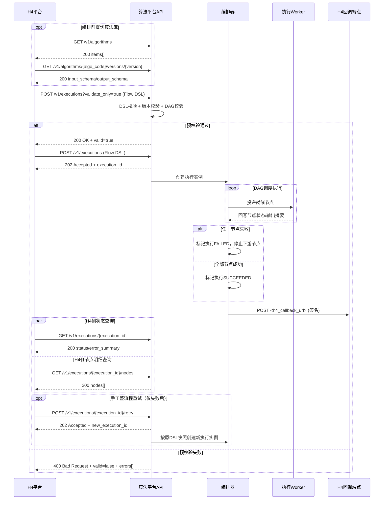
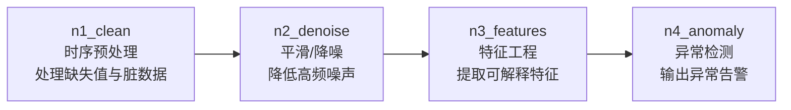

# 算法平台 和H4平台 总体方案讨论

**版本：v1.0**  

---

## 讨论内容

1. 明确双方系统边界与功能责任划分。  
2. 接口流程调用和消息结构。  
3. 确认联调计划、成功标准与上线前置条件。

---

## 基础共识

1. **编排归属H4平台，执行归属算法系统服务（）**。 **后续讨论-算法流程的编排、** 
2. 算法输入输出以 JSON Schema 手工注册并版本化。  
3. **H4平台负责一次性提交完整 Flow DSL。**  
4. **执行模式为异步（提交即返回 execution_id）（同步、）。**  
5. 失败策略：快速失败（任一节点失败即全流程失败），支持流程重试。

---

## 平台功能边界

### H4平台职责
1. 提供流程编排 UI（节点、连线、参数映射）。  
2. 生成并提交 Flow DSL。  
3. 展示执行状态、节点日志摘要、结果摘要。  
4. 提供回调接收端点（或使用轮询 API）。

### 算法平台职责
1. 算法库管理（算法定义、版本、Schema、状态）。  
2. Flow DSL 校验（结构、版本引用、无环校验、映射规则）。  
3. DAG 调度与节点执行。  
4. 运行态存储（execution/node 级状态与快照）。  
5. 结果回调与查询 API。

###  非目标（避免范围失控）
1. 不支持双端维护编排流程。  
2. 算法平台不做补偿事务/跳过节点/降级算法策略。  

---

##  接口调用流程

**校验服务要单独提供，**
**在提交前就先校验，避免后续报错**

1. 编排前，H4平台查询算法目录：`GET /v1/algorithms`。  
2. H4平台读取目标算法版本的输入输出定义：`GET /v1/algorithms/{algo_code}/versions/{version}`。  
3. H4平台先提交 Flow DSL 进行预校验：`POST /v1/executions?validate_only=true`。  
4. 算法平台完成 DSL 校验、算法版本校验、DAG 无环校验，并返回校验结果。  
5. 仅当预校验通过，H4平台才提交正式执行：`POST /v1/executions`。  
6. 算法平台受理后返回 `execution_id`，并创建执行实例。  
7. 编排器按 DAG 拓扑将就绪节点投递到执行队列。  
8. Worker 执行节点并回写节点状态与输出摘要。  
9. 任一节点失败时，流程整体失败并停止下游调度；全部成功则流程成功。  
10. 流程结束后，算法平台调用H4回调端点：`POST <h4_callback_url>`。  
11. H4平台可轮询流程状态：`GET /v1/executions/{execution_id}`。  
12. H4平台可查询节点明细：`GET /v1/executions/{execution_id}/nodes`；
13. 失败后可触发手工重试：`POST /v1/executions/{execution_id}/retry`



---

## API数据清单

### API 对齐清单

| 接口 | 方法 | 责任方 | 用途 | 关键返回 |
|---|---|---|---|---|
| `/v1/algorithms` | GET | 算法平台 | 按类别返回算法目录 | `categories[].algorithms[]` |
| `/v1/algorithms/{algo_code}/versions/{version}` | GET | 算法平台 | 获取算法版本 Schema | `input_schema`, `output_schema` |
| `/v1/executions` | POST | 算法平台 | 提交执行 | `execution_id`, `status=PENDING` |
| `/v1/executions/{execution_id}` | GET | 算法平台 | 流程状态查询 | `status`, `error_summary` |
| `/v1/executions/{execution_id}/nodes` | GET | 算法平台 | 节点状态查询 | `nodes[]` |
| `/v1/executions/{execution_id}/retry` | POST | 算法平台 | 手工整流程重试 | 新 `execution_id` |
| `<h4_callback_url>` | POST | H4平台 | 接收最终回调 | 回调验签通过/失败 |

### `GET /v1/algorithms`（按类别获取算法目录）

请求示例：

```http
GET /v1/algorithms?group_by=category&status=active HTTP/1.1
Authorization: Bearer <access_token>
X-Trace-Id: trace-20260306-001
```

成功返回示例（200）：

```json
{
  "categories": [
    {
      "category_code": "data_cleaning", # 算法类别
      "category_name": "数据清洗",
      "algorithms": [
        {
          "algo_code": "missing_value", 
          "name": "缺失值处理",
          "latest_version": "1.0.0",
          "status": "active"
        },
        {
          "algo_code": "anomaly_detect",
          "name": "异常检测",
          "latest_version": "1.0.0",
          "status": "active"
        }
      ]
    },
    {
      "category_code": "data_processing",
      "category_name": "数据处理",
      "algorithms": [
        {
          "algo_code": "normalize",
          "name": "数据标准化",
          "latest_version": "1.0.0",
          "status": "active"
        }
      ]
    }
  ],
  "total_categories": 2,
  "total_algorithms": 3
}
```

失败返回示例（401）：

```json
{
  "error_code": "UNAUTHORIZED",
  "error_message": "invalid access token",
  "trace_id": "trace-20260306-001"
}
```

### `GET /v1/algorithms/{algo_code}/versions/{version}`（算法版本 Schema）

请求示例：

```http
GET /v1/algorithms/missing_value/versions/1.0.0 HTTP/1.1
Authorization: Bearer <access_token>
X-Trace-Id: trace-20260306-001
```

成功返回示例（200）：

```json
{
  "algo_code": "missing_value",
  "version": "1.0.0",
  "input_schema": {
    "type": "object",
    "properties": {               
      "dataset_ref": { "type": "string",  "is_required": "true"}
    }
  },
  "output_schema": {
    "type": "object",
    "required": ["dataset_ref"],
    "properties": {
      "dataset_ref": { "type": "string",  "is_required": "true" }
    }
  },
  "default_timeout_sec": 60
}
```

失败返回示例（404）：

```json
{
  "error_code": "ALGO_VERSION_NOT_FOUND",
  "error_message": "missing_value@1.0.0 not found",
  "trace_id": "trace-20260306-001"
}
```

### `POST /v1/executions`（提交执行）

请求示例：

```http
POST /v1/executions HTTP/1.1
Authorization: Bearer <access_token>
Content-Type: application/json
Idempotency-Key: idem-20260306-0001
X-Trace-Id: trace-20260306-001
```

```json
{
  "meta": {
    "flow_code": "quality_flow_a",
    "flow_version": "1.0.0",
    "trace_id": "trace-20260306-001",
    "callback_url": "https://h4.example.com/api/algorithm/callback"
  },
  "nodes": [
    {
      "node_id": "n1",
      "algo_code": "missing_value",
      "algo_version": "1.0.0",
      "params": { "strategy": "mean" },
      "timeout_sec": 60
    },
    {
      "node_id": "n2",
      "algo_code": "anomaly_detect",
      "algo_version": "1.0.0",
      "params": { "method": "zscore", "threshold": 3 },
      "timeout_sec": 90
    }
  ],
  "edges": [
    {
      "from_node": "n1",
      "to_node": "n2",
      "mapping_rules": [
        { "from": "n1.output.dataset_ref", "to": "n2.input.dataset_ref" }
      ]
    }
  ],
  "inputs": {
    "dataset_ref": "dataset://prod/quality/2026-03-06-01"
  }
}
```

成功返回示例（202）：

```json
{
  "execution_id": "e-12345",
  "status": "PENDING",
  "trace_id": "trace-20260306-001"
}
```

失败返回示例（400）：

```json
{
  "error_code": "DSL_SCHEMA_INVALID",
  "error_message": "nodes[1].algo_version is required",
  "trace_id": "trace-20260306-001"
}
```

#### `GET /v1/executions/{execution_id}`（流程状态）

请求示例：

```http
GET /v1/executions/e-12345 HTTP/1.1
Authorization: Bearer <access_token>
X-Trace-Id: trace-20260306-001
```

成功返回示例（200）：

```json
{
  "execution_id": "e-12345",
  "flow_code": "quality_flow_a",
  "flow_version": "1.0.0",
  "status": "FAILED",
  "started_at": "2026-03-06T10:15:00Z",
  "ended_at": "2026-03-06T10:16:42Z",
  "error_summary": {
    "node_id": "n2",
    "error_type": "NODE_RUNTIME_ERROR",
    "error_message": "division by zero"
  },
  "trace_id": "trace-20260306-001"
}
```

失败返回示例（404）：

```json
{
  "error_code": "EXECUTION_NOT_FOUND",
  "error_message": "execution_id e-12345 not found",
  "trace_id": "trace-20260306-001"
}
```

#### 5.3.5 `GET /v1/executions/{execution_id}/nodes`（节点明细）

请求示例：

```http
GET /v1/executions/e-12345/nodes HTTP/1.1
Authorization: Bearer <access_token>
X-Trace-Id: trace-20260306-001
```

成功返回示例（200）：

```json
{
  "execution_id": "e-12345",
  "nodes": [
    {
      "node_id": "n1",
      "algo_code": "missing_value",
      "algo_version": "1.0.0",
      "status": "SUCCEEDED",
      "started_at": "2026-03-06T10:15:01Z",
      "ended_at": "2026-03-06T10:15:20Z",
      "output_summary": {
        "dataset_ref": "dataset://tmp/e-12345/n1-output"
      }
    },
    {
      "node_id": "n2",
      "algo_code": "anomaly_detect",
      "algo_version": "1.0.0",
      "status": "FAILED",
      "started_at": "2026-03-06T10:15:21Z",
      "ended_at": "2026-03-06T10:16:42Z",
      "error_detail": {
        "error_type": "NODE_RUNTIME_ERROR",
        "error_message": "division by zero"
      }
    }
  ],
  "trace_id": "trace-20260306-001"
}
```

失败返回示例（404）：

```json
{
  "error_code": "EXECUTION_NOT_FOUND",
  "error_message": "execution_id e-12345 not found",
  "trace_id": "trace-20260306-001"
}
```

#### 5.3.6 `POST /v1/executions/{execution_id}/retry`（整流程重试）

请求示例：

```http
POST /v1/executions/e-12345/retry HTTP/1.1
Authorization: Bearer <access_token>
Content-Type: application/json
X-Trace-Id: trace-20260306-001
```

```json
{
  "reason": "manual_retry_after_fix"
}
```

成功返回示例（202）：

```json
{
  "execution_id": "e-67890",
  "parent_execution_id": "e-12345",
  "status": "PENDING",
  "trace_id": "trace-20260306-001"
}
```

失败返回示例（409）：

```json
{
  "error_code": "RETRY_NOT_ALLOWED",
  "error_message": "only FAILED execution can be retried",
  "trace_id": "trace-20260306-001"
}
```

#### 5.3.7 `POST <h4_callback_url>`（算法平台回调H4平台）

请求示例（算法平台 -> H4平台）：

```http
POST /api/algorithm/callback HTTP/1.1
Content-Type: application/json
X-Signature: sha256=40f74f8d...
X-Timestamp: 2026-03-06T10:16:42Z
X-Trace-Id: trace-20260306-001
```

```json
{
  "execution_id": "e-12345",
  "flow_code": "quality_flow_a",
  "flow_version": "1.0.0",
  "final_status": "FAILED",
  "started_at": "2026-03-06T10:15:00Z",
  "ended_at": "2026-03-06T10:16:42Z",
  "error_summary": {
    "node_id": "n2",
    "error_type": "RUNTIME_ERROR",
    "error_message": "division by zero"
  },
  "trace_id": "trace-20260306-001"
}
```

成功返回示例（200）：

```json
{
  "accepted": true,
  "trace_id": "trace-20260306-001"
}
```

失败返回示例（401）：

```json
{
  "error_code": "INVALID_SIGNATURE",
  "error_message": "signature verification failed",
  "trace_id": "trace-20260306-001"
}
```

### 错误码建议（一期最小集合）

| 错误码 | 场景 | HTTP | 说明 |
|---|---|---|---|
| `DSL_SCHEMA_INVALID` | DSL 结构不合法 | 400 | 缺字段/字段类型错误 |
| `FLOW_GRAPH_CYCLE` | DAG 有环 | 400 | 流程不可执行 |
| `ALGO_VERSION_NOT_FOUND` | 算法版本不存在 | 400 | 版本引用无效 |
| `IDEMPOTENCY_CONFLICT` | 幂等冲突 | 409 | 重复提交且语义冲突 |
| `NODE_TIMEOUT` | 节点超时 | 500 | 执行期超时 |
| `NODE_RUNTIME_ERROR` | 节点运行异常 | 500 | 算法执行异常 |

---

## 工作计划

### 阶段 0：方案确定与任务拆解（`2026-03-06`，周五）

1. 确定总体方案可行性
2. 确定 `API`、`Flow DSL`、`回调签名规则 v1`。  
3. 确定首批上线算法范围（数据清洗、数据处理）和一期非目标。  
4. **现有的算法**、**提出自己认为合理的算法范围**

### 阶段 1：环境打通（`2026-03-09~03-13`，周一~周五）

1. 算法平台：搭建算法平台架构，并完成基础接口模拟数据开发工作。  
2. 算法平台：发布接口定稿（含字段注释示例、错误码）。
3. H4平台：完成算法目录与算法版本查询的前端测试接口。  
4. 双方联调：完成基础连通性验证（鉴权等校验）。  

### 阶段 2：算法平台核心能力实现（`2026-03-16~03-27，周一~周五）

1. 完成算法目录接口（按类别分组返回）与算法版本 Schema 接口（**h4平台**和**算法平台**）。  
2. 完成执行提交接口（含幂等键）与 DSL 校验（含 DAG 无环、版本引用校验）。  
3. 完成执行查询、节点查询、、手动重试接口（仅 `FAILED` 可重试）。  
4. 完成回调发送模块（`HMAC-SHA256`、重试策略、失败日志记录）。  
5. 完成最小测试集：成功链路、失败链路、幂等提交、回调失败重试。  

### 阶段 3：H4平台接入和联调（`2026-03-30~04-03`，周一~周五）

1. 打通提交流程（编排 -> 提交 -> execution_id 回填）。  
2. 打通状态页（流程状态、节点明细、失败摘要、手工重试入口）。  
3. 校验“回调状态”与“轮询状态”一致性。  
4. 输出物：`API可用版本`、`接口自测报告`、`回调重试验证记录`

### 阶段 4：测试与上线（`2026-04-06~04-10`，周一~周五）

1. `03-26`：上线测试（限定算法范围与调用流量），开启核心监控与告警。  
2. `03-26`：观察指标（成功率、回调成功率、平均时长、失败节点分布）。  

# 总体方案v1.0讨论修改

## 工作流校验流程修改

### 修改点

之前的计划是 H4平台提交 Flow DSL，后台直接执行，并进行校验，如果校验不通过则执行失败
现在修改为
用户指定好  Flow DSL 之后，首先调用接口进行校验，后台执行校验通过后，才能进一步执行提交执行操作

### 是否采纳

同意采纳，先校验再执行能够降低算法流程执行成本，提升用户体验。

### 修改结果

**修改后的流程见 1.4 章节**

## 流程编排

我个人的理解是 算法平台提供常见的 算法流程编排模板，用户能够加载模板，并修改或填充相应的算法。以下面的时序数据质量诊断模板为例，H4平台接收到算法模板以后，呈现给用户，并支持填充或者修改算法类型，甚至是添加算法步骤

### 模板 A：时序数据质量诊断模板

#### 流程图：



1. `n1_clean`（时序预处理类算法）：处理缺失值与明显脏数据，保证后续算法输入可用。  
2. `n2_denoise`（平滑/降噪类算法）：降低高频噪声，提升特征稳定性。  
3. `n3_features`（时序特征工程类算法）：提取可解释特征（均值、RMS、峰值因子等）供诊断或建模。  
4. `n4_anomaly`（异常检测类算法）：识别异常区间/异常点并输出告警结果。  

#### 前端返回的Flow DSL 示例

```json
{
  "meta": {
    "flow_code": "tpl_ts_quality_diagnosis_v1",
    "flow_version": "1.0.0",
    "trace_id": "${trace_id}",
    "callback_url": "${h4_callback_url}"
  },
  "nodes": [
    {
      "node_id": "n1_clean",
      "algo_code": "${algo_clean}",
      "algo_version": "${algo_clean_version}",
      "params": {
        "missing_strategy": "linear_interp"
      },
      "timeout_sec": 60
    },
    {
      "node_id": "n2_denoise",
      "algo_code": "${algo_denoise}",
      "algo_version": "${algo_denoise_version}",
      "params": {
        "method": "savgol",
        "window": 11
      },
      "timeout_sec": 60
    },
    {
      "node_id": "n3_features",
      "algo_code": "${algo_feature}",
      "algo_version": "${algo_feature_version}",
      "params": {
        "features": ["mean", "rms", "kurtosis", "skewness"]
      },
      "timeout_sec": 90
    },
    {
      "node_id": "n4_anomaly",
      "algo_code": "${algo_anomaly}",
      "algo_version": "${algo_anomaly_version}",
      "params": {
        "method": "zscore",
        "threshold": 3
      },
      "timeout_sec": 90
    }
  ],
  "edges": [
    { "from_node": "n1_clean", "to_node": "n2_denoise", "mapping_rules": [] },
    { "from_node": "n2_denoise", "to_node": "n3_features", "mapping_rules": [] },
    { "from_node": "n3_features", "to_node": "n4_anomaly", "mapping_rules": [] }
  ],
  "inputs": {
    "dataset_ref": "${dataset_ref}"
  }
}
```


## 常见算法罗列

### 时序数据算法

#### 时序预处理（Preprocessing）

| 算法编码                 | 算法名称                  | 算法说明                     | 核心公式/规则                           |
| ------------------------ | ------------------------- | ---------------------------- | --------------------------------------- |
| `ts_clean_linear_interp` | 线性插值填充              | 用前后有效点线性估计缺失值   | `x_t = x_a + (x_b - x_a) * (t-a)/(b-a)` |
| `ts_clean_ffill`         | 前向填充（Forward Fill）  | 使用前一个有效值填充缺失值   | `x_t = x_{t-1}`                         |
| `ts_clean_bfill`         | 后向填充（Backward Fill） | 使用后一个有效值填充缺失值   | `x_t = x_{t+1}`                         |
| `ts_clean_mean_impute`   | 均值填充                  | 用该变量历史均值填充缺失值   | `x_t = mu, mu = (1/N) * sum(x_i)`       |
| `ts_clean_drop`          | 缺失样本删除              | 缺失比例超过阈值时删除样本   | `drop if missing_ratio > tau`           |
| `ts_smooth_savgol`       | Savitzky-Golay 滤波       | 局部多项式拟合平滑，保留峰形 | `y_t = sum(c_k * x_{t+k})`              |
| `ts_smooth_median`       | 中值滤波                  | 抑制脉冲噪声                 | `y_t = median(x_{t-k...t+k})`           |
| `ts_smooth_ma`           | 移动平均                  | 降低高频抖动                 | `y_t = (1/w) * sum_{i=0}^{w-1} x_{t-i}` |
| `ts_smooth_gaussian`     | 高斯滤波                  | 使用高斯核平滑时序           | `y_t = sum(G_k * x_{t-k})`              |
| `ts_filter_butter_lp`    | 巴特沃斯低通滤波          | 抑制高频分量，保持通带平坦   | `|H(jw)|^2 = 1 / (1 + (w/w_c)^(2n))`    |

#### 时序特征工程

| 算法编码            | 算法名称      | 算法说明                 | 核心公式/规则                         |
| ------------------- | ------------- | ------------------------ | ------------------------------------- |
| `ts_feat_mean`      | 均值          | 描述信号中心趋势         | `mu = (1/N) * sum(x_i)`               |
| `ts_feat_var`       | 方差          | 描述波动强度             | `sigma^2 = (1/N) * sum((x_i - mu)^2)` |
| `ts_feat_range`     | 极差          | 描述振幅范围             | `range = max(x) - min(x)`             |
| `ts_feat_rms`       | 均方根（RMS） | 表征能量大小             | `RMS = sqrt((1/N) * sum(x_i^2))`      |
| `ts_feat_crest`     | 峰值因子      | 峰值与能量比值           | `crest = x_peak / RMS`                |
| `ts_feat_waveform`  | 波形因子      | 有效值与平均整流值比值   | `waveform = RMS / mean(|x|)`          |
| `ts_feat_kurtosis`  | 峭度          | 描述尖峰程度             | `kurt = E[(x-mu)^4] / sigma^4`        |
| `ts_feat_skewness`  | 偏度          | 描述分布偏斜方向         | `skew = E[(x-mu)^3] / sigma^3`        |
| `ts_window_sliding` | 滑动窗口切分  | 将长序列切为固定长度片段 | `window_i = x[i*s : i*s + L]`         |

#### 频域分析与异常检测

| 算法编码                | 算法名称         | 算法说明                       | 核心公式/规则                                    |
| ----------------------- | ---------------- | ------------------------------ | ------------------------------------------------ |
| `ts_fft_spectrum`       | FFT 频谱分析     | 将时域信号转换到频域           | `X_k = sum_{n=0}^{N-1} x_n * exp(-j*2*pi*k*n/N)` |
| `ts_feat_centroid_freq` | 重心频率         | 表征频谱“质量中心”             | `f_c = sum(f_k * P_k) / sum(P_k)`                |
| `ts_feat_msf`           | 均方频率         | 频率二阶统计量                 | `MSF = sum(f_k^2 * P_k) / sum(P_k)`              |
| `ts_feat_peak_freq`     | 峰值频率         | 能量峰值所在频率               | `f_peak = argmax(P_k)`                           |
| `ts_feat_hp_bandwidth`  | 半功率带宽       | 衡量主峰带宽                   | `P(f1)=P(f2)=P_max/2, BW=f2-f1`                  |
| `ts_anom_iqr`           | IQR 异常检测     | 四分位规则检测离群点           | `x < Q1-1.5*IQR or x > Q3+1.5*IQR`               |
| `ts_anom_zscore`        | Z-Score 异常检测 | 标准分数阈值检测               | `z = (x - mu)/sigma, abs(z) > tau`               |
| `ts_anom_mad`           | MAD 异常检测     | 对重尾分布更稳健               | `MAD = median(|x - median(x)|)`                  |
| `ts_anom_iforest`       | Isolation Forest | 基于随机切分路径长度做异常评分 | `s(x,n) = 2^(-E(h(x))/c(n))`                     |

### 文本与大语言模型算法

#### 文档解析与语义检索

| 算法编码                | 算法名称             | 算法说明                                           | 核心公式/规则                                              |
| ----------------------- | -------------------- | -------------------------------------------------- | ---------------------------------------------------------- |
| `txt_parse_multiformat` | 多格式文档解析       | 统一解析 PDF/Word/Excel/PPT/HTML/Markdown/JSON/TXT | `parse(file) -> blocks/tables/text`                        |
| `txt_chunk_sliding`     | 文本滑窗切分         | 长文按长度与步长切块                               | `chunk_i = tokens[i*s : i*s + L]`                          |
| `txt_feat_tfidf`        | TF-IDF 向量化        | 基础关键词权重表示                                 | `tfidf(t,d)=tf(t,d)*log(N/df(t))`                          |
| `txt_rank_bm25`         | BM25 检索评分        | 关键词检索排序                                     | `score = sum(IDF * (tf*(k1+1))/(tf+k1*(1-b+b*|d|/avgdl)))` |
| `txt_embed_cosine`      | 向量余弦相似度       | 语义检索与召回                                     | `cos = (u·v) / (||u||*||v||)`                              |
| `txt_textrank`          | TextRank 关键词/摘要 | 图排序抽取关键词或句子                             | `S(V_i)=(1-d)+d*sum(S(V_j)/Out(V_j))`                      |

#### LLM 抽取与图谱构建

| 算法编码              | 算法名称            | 算法说明                          | 核心公式/规则                                  |
| --------------------- | ------------------- | --------------------------------- | ---------------------------------------------- |
| `llm_schema_extract`  | Schema 约束信息抽取 | 按实体/关系 Schema 抽取结构化结果 | `extract(text, schema) -> entities, relations` |
| `llm_prompt_auto_gen` | Prompt 自动生成     | 根据 Schema 自动拼装抽取提示词    | `prompt = template(schema, examples, text)`    |
| `llm_relation_cls`    | 关系分类            | 对候选实体对做关系判断            | `p(r|h,t) = softmax(W * [h;t] + b)`            |
| `llm_kg_build`        | 图谱构建映射        | 抽取结果映射到图数据库节点和边    | `G=(V,E), V=entities, E=relations`             |

#### 垂类信息抽取

| 算法编码               | 算法名称       | 算法说明                             | 核心公式/规则                          |
| ---------------------- | -------------- | ------------------------------------ | -------------------------------------- |
| `txt_cv_field_extract` | 简历字段抽取   | 抽取姓名、联系方式、教育、经历等字段 | `fields = extractor(text)`             |
| `txt_cv_normalize`     | 字段标准化对齐 | 非标准字段映射到统一口径             | `value_std = map(rule_set, value_raw)` |
| `txt_cv_conf_score`    | 抽取置信度融合 | 规则、模型、上下文多源融合评分       | `score = a*rule + b*model + c*context` |

###  图像与计算机视觉算法

#### 目标检测推理（YOLO）

| 算法编码                | 算法名称            | 算法说明                    | 核心公式/规则                           |
| ----------------------- | ------------------- | --------------------------- | --------------------------------------- |
| `cv_det_yolov8_single`  | YOLOv8 单图检测     | 对单张图片执行目标检测      | `conf = P(obj) * P(class|obj)`          |
| `cv_det_yolov8_batch`   | YOLOv8 批量检测     | 多图批处理推理              | `batch_infer(images)`                   |
| `cv_det_yolov8_stream`  | YOLOv8 流式推理     | 视频帧实时检测              | `infer(frame_t) -> boxes_t`             |
| `cv_det_iou`            | IoU 计算            | 衡量预测框与真值框重叠程度  | `IoU = area(A∩B) / area(A∪B)`           |
| `cv_det_nms`            | 非极大值抑制（NMS） | 去除重复框                  | `keep box_i if IoU(box_i, box_j) < tau` |
| `cv_det_thresh_control` | 阈值控制            | 动态调整置信度/IoU/输入尺寸 | `accept if conf >= conf_thr`            |

####  版面识别与 OCR

| 算法编码                 | 算法名称            | 算法说明                         | 核心公式/规则                               |
| ------------------------ | ------------------- | -------------------------------- | ------------------------------------------- |
| `cv_layout_detr`         | DETR 版面识别       | 识别文本块、标题、段落、图表区域 | `Attention(Q,K,V)=softmax(QK^T/sqrt(d_k))V` |
| `cv_layout_order`        | 坐标流排序          | 按阅读顺序重排版面块             | `sort by (y, x)`                            |
| `cv_tsr_table_structure` | 表格结构识别（TSR） | 识别表头、跨行跨列并还原结构     | `table = reconstruct(cells, spans)`         |
| `cv_ocr_text_rec`        | OCR 文字识别        | 基于检测区域识别文本             | `L_ctc = -log P(y|x)`                       |
| `cv_ocr_layout_fusion`   | 版面 + OCR 融合     | 结合坐标与文本重建文档逻辑       | `doc = fuse(layout_blocks, ocr_text)`       |

#### 视觉增强与处理

| 算法编码            | 算法名称        | 算法说明               | 核心公式/规则            |
| ------------------- | --------------- | ---------------------- | ------------------------ |
| `cv_aug_normalize`  | 图像归一化      | 统一像素分布           | `x' = (x - mu) / sigma`  |
| `cv_aug_flip`       | 随机翻转        | 增强方向不变性         | `x' = flip(x)`           |
| `cv_aug_rotate`     | 随机旋转        | 增强角度鲁棒性         | `x' = R(theta) * x`      |
| `cv_aug_brightness` | 亮度/对比度增强 | 改善光照多样性         | `x' = alpha*x + beta`    |
| `cv_aug_gamma`      | Gamma 增强      | 非线性亮度校正         | `x' = x^gamma`           |
| `cv_aug_render_vis` | 结果渲染可视化  | 自动绘制边界框与置信度 | `draw(box, label, conf)` |


