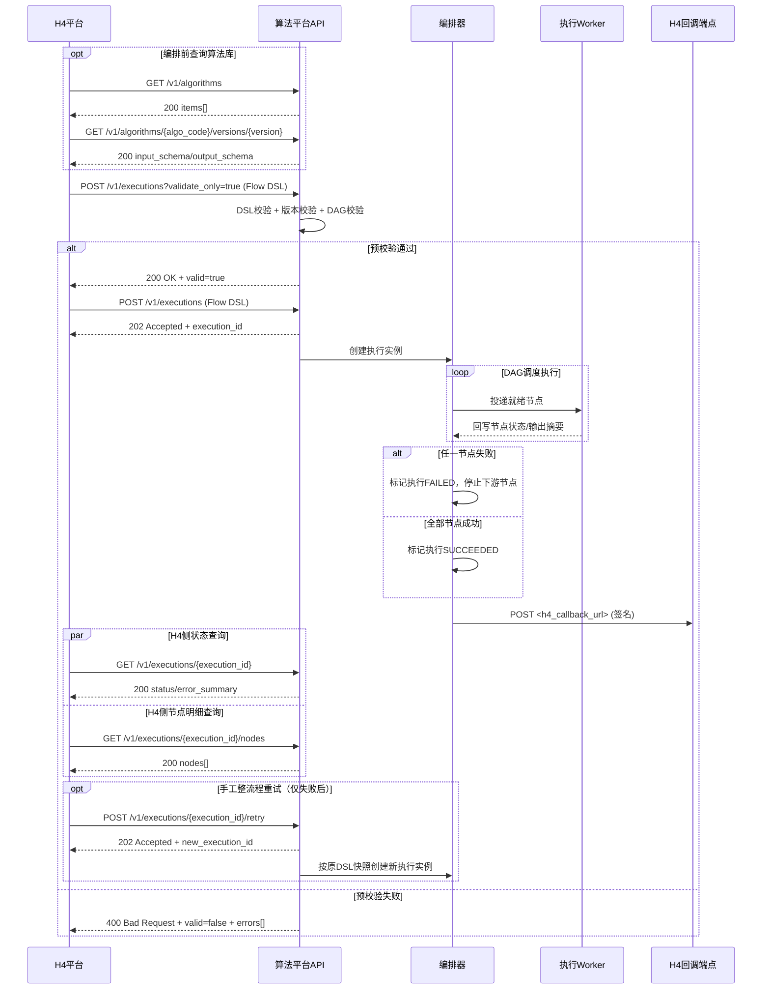
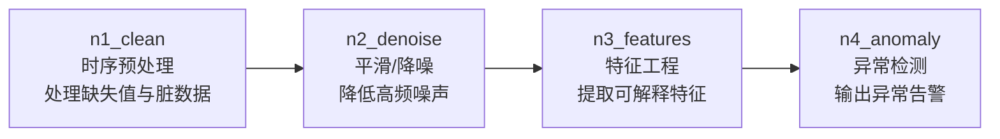
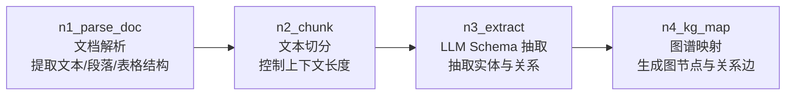
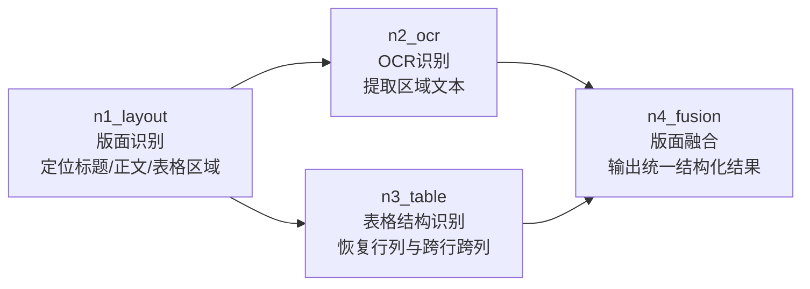

# 算法平台 × H4平台 方案对齐会材料（详细版）

> 版本：v1.0  
> 文档日期：2026-03-05  
> 会议日期：2026-03-06  
> 文档用途：用于跨团队方案对齐会现场讲解与决策记录

---

## 1. 会议基本信息

### 1.1 会议主题
算法平台与H4平台联动方案对齐（一期）

### 1.2 会议目标（本次只做三件事）
1. 明确双方系统边界与责任划分。  
2. 冻结一期接口与数据契约（提交、查询、回调）。  
3. 确认联调计划、验收标准与上线前置条件。

### 1.3 期望会议产出
1. 《已拍板决策清单》一份。  
2. 《联调行动项》一份（负责人 + 截止日期）。  
3. 《风险与兜底方案》一份。

### 1.4 建议参会角色
- H4平台：产品负责人、前端负责人、后端负责人、测试负责人。  
- 算法平台：产品/方案负责人、后端负责人、算法负责人、测试负责人。  
- 可选：运维/平台负责人（回调安全、环境开通、监控告警）。

---

## 2. 背景与已达成共识

### 2.1 背景
H4平台负责流程编排与可视化配置；算法平台提供算法库能力与流程执行能力。H4平台期望通过“提交完整流程 DSL”的方式触发算法执行，并通过回调/轮询获取结果。

### 2.2 当前共识（会前确认）
1. 编排归属H4平台，执行归属算法平台。  
2. H4平台一次性提交完整 Flow DSL。  
3. 算法平台按 DAG 进行调度执行。  
4. 执行模式为异步（提交即返回 execution_id）。  
5. 算法输入输出以 JSON Schema 手工注册并版本化。  
6. 一期并发目标：< 50 流程实例。  
7. 失败策略：快速失败（任一节点失败即全流程失败），支持手工整流程重试。

---

## 3. 一期系统边界（必须冻结）

### 3.1 H4平台职责
1. 提供流程编排 UI（节点、连线、参数映射）。  
2. 生成并提交 Flow DSL。  
3. 展示执行状态、节点日志摘要、结果摘要。  
4. 提供回调接收端点（或使用轮询 API）。

### 3.2 算法平台职责
1. 算法库管理（算法定义、版本、Schema、状态）。  
2. DSL 校验（结构、版本引用、无环校验、映射规则）。  
3. DAG 调度与节点执行。  
4. 运行态存储（execution/node 级状态与快照）。  
5. 结果回调与查询 API。

### 3.3 一期非目标（避免范围失控）
1. 不支持双端维护流程定义（防止双真相源）。  
2. 不做补偿事务/跳过节点/降级算法策略。  
3. 不做高并发分布式调度集群。

---

## 4. 端到端流程说明（用于会上讲解）

### 4.1 文字版流程（覆盖 API 对齐清单全部接口）
1. 编排前，H4平台查询算法目录：`GET /v1/algorithms`。  
2. H4平台读取目标算法版本的输入输出定义：`GET /v1/algorithms/{algo_code}/versions/{version}`。  
3. H4平台先提交 Flow DSL 进行预校验：`POST /v1/executions?validate_only=true`。  
4. 算法平台完成 DSL 校验、算法版本校验、DAG 无环校验，并返回校验结果。  
5. 仅当预校验通过，H4平台才提交正式执行：`POST /v1/executions`。  
6. 算法平台受理后返回 `execution_id`，并创建执行实例。  
7. 编排器按 DAG 拓扑将就绪节点投递到执行队列。  
8. Worker 执行节点并回写节点状态与输出摘要。  
9. 任一节点失败时，流程整体失败并停止下游调度；全部成功则流程成功。  
10. 流程结束后，算法平台调用H4回调端点：`POST <h4_callback_url>`。  
11. H4平台可轮询流程状态：`GET /v1/executions/{execution_id}`。  
12. H4平台可查询节点明细：`GET /v1/executions/{execution_id}/nodes`；失败后可触发手工重试：`POST /v1/executions/{execution_id}/retry`。

### 4.2 总时序图（覆盖 API 对齐清单 7 个接口，可直接贴 Mermaid）



---

## 5. 数据与契约对齐

### 5.1 Flow DSL 最小结构（一期）

```json
{
  "meta": {
    "flow_code": "quality_flow_a",
    "flow_version": "1.0.0",
    "trace_id": "trace-20260306-001",
    "callback_url": "https://h4.example.com/api/algorithm/callback"
  },
  "nodes": [
    {
      "node_id": "n1",
      "algo_code": "missing_value",
      "algo_version": "1.0.0",
      "params": {
        "strategy": "mean"
      },
      "timeout_sec": 60
    },
    {
      "node_id": "n2",
      "algo_code": "anomaly_detect",
      "algo_version": "1.0.0",
      "params": {
        "method": "zscore",
        "threshold": 3
      },
      "timeout_sec": 90
    }
  ],
  "edges": [
    {
      "from_node": "n1",
      "to_node": "n2",
      "mapping_rules": [
        {
          "from": "n1.output.dataset_ref",
          "to": "n2.input.dataset_ref"
        }
      ]
    }
  ],
  "inputs": {
    "dataset_ref": "dataset://prod/quality/2026-03-06-01"
  }
}
```

### 5.2 API 对齐清单（会上逐条过）

| 接口 | 方法 | 责任方 | 用途 | 关键返回 |
|---|---|---|---|---|
| `/v1/algorithms` | GET | 算法平台 | 按类别返回算法目录 | `categories[].algorithms[]` |
| `/v1/algorithms/{algo_code}/versions/{version}` | GET | 算法平台 | 获取算法版本 Schema | `input_schema`, `output_schema` |
| `/v1/executions` | POST | 算法平台 | 提交执行 | `execution_id`, `status=PENDING` |
| `/v1/executions/{execution_id}` | GET | 算法平台 | 流程状态查询 | `status`, `error_summary` |
| `/v1/executions/{execution_id}/nodes` | GET | 算法平台 | 节点状态查询 | `nodes[]` |
| `/v1/executions/{execution_id}/retry` | POST | 算法平台 | 手工整流程重试 | 新 `execution_id` |
| `<h4_callback_url>` | POST | H4平台 | 接收最终回调 | 回调验签通过/失败 |

### 5.3 接口请求与返回数据示例（一期）

> 统一约定：除回调接口外，均为“H4平台 -> 算法平台”调用；示例中的 `trace_id` 用于全链路追踪。
> 注：每个接口都补充了“字段注释”，现场可直接按注释解释字段含义。

#### 5.3.1 `GET /v1/algorithms`（按类别获取算法目录）

请求示例：

```http
GET /v1/algorithms?group_by=category&status=active HTTP/1.1
Authorization: Bearer <access_token>
X-Trace-Id: trace-20260306-001
```

请求字段注释：
- `group_by=category`：要求按算法类别分组返回。
- `status=active`：仅返回可用/已启用算法。
- `Authorization`：H4平台访问令牌。
- `X-Trace-Id`：链路追踪 ID，用于日志关联。

成功返回示例（200）：

```json
{
  "categories": [
    {
      "category_code": "data_cleaning",
      "category_name": "数据清洗",
      "algorithms": [
        {
          "algo_code": "missing_value",
          "name": "缺失值处理",
          "latest_version": "1.0.0",
          "status": "active"
        },
        {
          "algo_code": "anomaly_detect",
          "name": "异常检测",
          "latest_version": "1.0.0",
          "status": "active"
        }
      ]
    },
    {
      "category_code": "data_processing",
      "category_name": "数据处理",
      "algorithms": [
        {
          "algo_code": "normalize",
          "name": "数据标准化",
          "latest_version": "1.0.0",
          "status": "active"
        }
      ]
    }
  ],
  "total_categories": 2,
  "total_algorithms": 3
}
```

成功返回字段注释：
- `categories`：按类别分组后的算法目录。
- `category_code`：类别机器码，供前端分组与过滤使用。
- `category_name`：类别展示名称（如“数据清洗”）。
- `algorithms`：该类别下算法列表。
- `algo_code`：算法唯一编码，后续编排和执行引用它。
- `latest_version`：该算法当前默认可选最新版本。
- `total_categories`：类别总数。
- `total_algorithms`：算法总数。

失败返回示例（401）：

```json
{
  "error_code": "UNAUTHORIZED",
  "error_message": "invalid access token",
  "trace_id": "trace-20260306-001"
}
```

失败返回字段注释：
- `error_code`：错误类型编码，便于程序分支处理。
- `error_message`：错误详情，便于排障。
- `trace_id`：可回查算法平台日志。

#### 5.3.2 `GET /v1/algorithms/{algo_code}/versions/{version}`（算法版本 Schema）

请求示例：

```http
GET /v1/algorithms/missing_value/versions/1.0.0 HTTP/1.1
Authorization: Bearer <access_token>
X-Trace-Id: trace-20260306-001
```

请求字段注释：
- `missing_value`：算法编码（`algo_code`）。
- `1.0.0`：算法版本（`algo_version`），建议编排时显式锁定。
- `Authorization`：H4平台访问令牌。
- `X-Trace-Id`：链路追踪 ID。

成功返回示例（200）：

```json
{
  "algo_code": "missing_value",
  "version": "1.0.0",
  "input_schema": {
    "type": "object",
    "required": ["dataset_ref"],
    "properties": {
      "dataset_ref": { "type": "string" }
    }
  },
  "output_schema": {
    "type": "object",
    "required": ["dataset_ref"],
    "properties": {
      "dataset_ref": { "type": "string" }
    }
  },
  "default_timeout_sec": 60
}
```

成功返回字段注释：
- `input_schema`：该算法期望的输入参数结构。
- `output_schema`：该算法输出参数结构。
- `required`：必填参数列表。
- `properties`：参数字段定义（类型、格式等）。
- `default_timeout_sec`：节点默认超时时间，编排时可覆盖。

失败返回示例（404）：

```json
{
  "error_code": "ALGO_VERSION_NOT_FOUND",
  "error_message": "missing_value@1.0.0 not found",
  "trace_id": "trace-20260306-001"
}
```

失败返回字段注释：
- `ALGO_VERSION_NOT_FOUND`：算法编码或版本不存在。
- `trace_id`：用于定位查询接口日志。

#### 5.3.3 `POST /v1/executions`（提交执行）

请求示例：

```http
POST /v1/executions HTTP/1.1
Authorization: Bearer <access_token>
Content-Type: application/json
Idempotency-Key: idem-20260306-0001
X-Trace-Id: trace-20260306-001
```

请求头字段注释：
- `Idempotency-Key`：幂等键，防止重复提交流程产生重复执行。
- `Content-Type`：请求体 JSON 格式声明。
- `Authorization`/`X-Trace-Id`：鉴权与追踪。

```json
{
  "meta": {
    "flow_code": "quality_flow_a",
    "flow_version": "1.0.0",
    "trace_id": "trace-20260306-001",
    "callback_url": "https://h4.example.com/api/algorithm/callback"
  },
  "nodes": [
    {
      "node_id": "n1",
      "algo_code": "missing_value",
      "algo_version": "1.0.0",
      "params": { "strategy": "mean" },
      "timeout_sec": 60
    },
    {
      "node_id": "n2",
      "algo_code": "anomaly_detect",
      "algo_version": "1.0.0",
      "params": { "method": "zscore", "threshold": 3 },
      "timeout_sec": 90
    }
  ],
  "edges": [
    {
      "from_node": "n1",
      "to_node": "n2",
      "mapping_rules": [
        { "from": "n1.output.dataset_ref", "to": "n2.input.dataset_ref" }
      ]
    }
  ],
  "inputs": {
    "dataset_ref": "dataset://prod/quality/2026-03-06-01"
  }
}
```

请求体字段注释：
- `meta.flow_code`：流程编码。
- `meta.flow_version`：流程版本。
- `meta.trace_id`：本次执行全链路追踪标识。
- `meta.callback_url`：流程完成后回调到 H4 的地址。
- `nodes`：流程节点定义数组。
- `nodes[].algo_code/algo_version`：节点绑定的算法及版本。
- `nodes[].params`：节点算法参数。
- `edges`：节点依赖关系。
- `mapping_rules`：上游输出到下游输入的字段映射规则。
- `inputs`：流程初始输入数据（入口参数）。

成功返回示例（202）：

```json
{
  "execution_id": "e-12345",
  "status": "PENDING",
  "trace_id": "trace-20260306-001"
}
```

成功返回字段注释：
- `execution_id`：执行实例唯一 ID，后续查询/重试都用它。
- `status=PENDING`：任务已受理，等待调度执行。
- `trace_id`：链路追踪 ID。

失败返回示例（400）：

```json
{
  "error_code": "DSL_SCHEMA_INVALID",
  "error_message": "nodes[1].algo_version is required",
  "trace_id": "trace-20260306-001"
}
```

失败返回字段注释：
- `DSL_SCHEMA_INVALID`：流程 DSL 结构不符合约束。
- `error_message`：具体到字段级别的校验错误。

#### 5.3.4 `GET /v1/executions/{execution_id}`（流程状态）

请求示例：

```http
GET /v1/executions/e-12345 HTTP/1.1
Authorization: Bearer <access_token>
X-Trace-Id: trace-20260306-001
```

请求字段注释：
- `e-12345`：待查询的执行实例 ID。
- `X-Trace-Id`：请求追踪 ID。

成功返回示例（200）：

```json
{
  "execution_id": "e-12345",
  "flow_code": "quality_flow_a",
  "flow_version": "1.0.0",
  "status": "FAILED",
  "started_at": "2026-03-06T10:15:00Z",
  "ended_at": "2026-03-06T10:16:42Z",
  "error_summary": {
    "node_id": "n2",
    "error_type": "NODE_RUNTIME_ERROR",
    "error_message": "division by zero"
  },
  "trace_id": "trace-20260306-001"
}
```

成功返回字段注释：
- `status`：流程状态（`PENDING/RUNNING/SUCCEEDED/FAILED`）。
- `started_at/ended_at`：执行开始/结束时间。
- `error_summary`：失败摘要（成功时可为空）。
- `error_summary.node_id`：首次失败节点。

失败返回示例（404）：

```json
{
  "error_code": "EXECUTION_NOT_FOUND",
  "error_message": "execution_id e-12345 not found",
  "trace_id": "trace-20260306-001"
}
```

失败返回字段注释：
- `EXECUTION_NOT_FOUND`：执行实例不存在或无权限访问。

#### 5.3.5 `GET /v1/executions/{execution_id}/nodes`（节点明细）

请求示例：

```http
GET /v1/executions/e-12345/nodes HTTP/1.1
Authorization: Bearer <access_token>
X-Trace-Id: trace-20260306-001
```

请求字段注释：
- `/nodes`：查询该执行下所有节点的运行明细。

成功返回示例（200）：

```json
{
  "execution_id": "e-12345",
  "nodes": [
    {
      "node_id": "n1",
      "algo_code": "missing_value",
      "algo_version": "1.0.0",
      "status": "SUCCEEDED",
      "started_at": "2026-03-06T10:15:01Z",
      "ended_at": "2026-03-06T10:15:20Z",
      "output_summary": {
        "dataset_ref": "dataset://tmp/e-12345/n1-output"
      }
    },
    {
      "node_id": "n2",
      "algo_code": "anomaly_detect",
      "algo_version": "1.0.0",
      "status": "FAILED",
      "started_at": "2026-03-06T10:15:21Z",
      "ended_at": "2026-03-06T10:16:42Z",
      "error_detail": {
        "error_type": "NODE_RUNTIME_ERROR",
        "error_message": "division by zero"
      }
    }
  ],
  "trace_id": "trace-20260306-001"
}
```

成功返回字段注释：
- `nodes[]`：节点运行明细列表。
- `nodes[].status`：节点状态（`PENDING/RUNNING/SUCCEEDED/FAILED/SKIPPED`）。
- `output_summary`：节点输出摘要，避免回传大对象。
- `error_detail`：失败节点详细错误。

失败返回示例（404）：

```json
{
  "error_code": "EXECUTION_NOT_FOUND",
  "error_message": "execution_id e-12345 not found",
  "trace_id": "trace-20260306-001"
}
```

失败返回字段注释：
- `EXECUTION_NOT_FOUND`：执行实例不存在。

#### 5.3.6 `POST /v1/executions/{execution_id}/retry`（手工整流程重试）

请求示例：

```http
POST /v1/executions/e-12345/retry HTTP/1.1
Authorization: Bearer <access_token>
Content-Type: application/json
X-Trace-Id: trace-20260306-001
```

请求字段注释：
- `e-12345`：原失败执行 ID。
- `reason`：手工重试原因，便于审计。

```json
{
  "reason": "manual_retry_after_fix"
}
```

成功返回示例（202）：

```json
{
  "execution_id": "e-67890",
  "parent_execution_id": "e-12345",
  "status": "PENDING",
  "trace_id": "trace-20260306-001"
}
```

成功返回字段注释：
- `execution_id`：新建的重试执行 ID。
- `parent_execution_id`：原始执行 ID，便于追溯关联。
- `status=PENDING`：重试任务已受理。

失败返回示例（409）：

```json
{
  "error_code": "RETRY_NOT_ALLOWED",
  "error_message": "only FAILED execution can be retried",
  "trace_id": "trace-20260306-001"
}
```

失败返回字段注释：
- `RETRY_NOT_ALLOWED`：当前状态不允许重试（通常不是 FAILED）。

#### 5.3.7 `POST <h4_callback_url>`（算法平台回调H4平台）

请求示例（算法平台 -> H4平台）：

```http
POST /api/algorithm/callback HTTP/1.1
Content-Type: application/json
X-Signature: sha256=40f74f8d...
X-Timestamp: 2026-03-06T10:16:42Z
X-Trace-Id: trace-20260306-001
```

回调请求头字段注释：
- `X-Signature`：签名值，H4平台用于验签。
- `X-Timestamp`：签名时间戳，防重放攻击。
- `X-Trace-Id`：双方日志关联 ID。

```json
{
  "execution_id": "e-12345",
  "flow_code": "quality_flow_a",
  "flow_version": "1.0.0",
  "final_status": "FAILED",
  "started_at": "2026-03-06T10:15:00Z",
  "ended_at": "2026-03-06T10:16:42Z",
  "error_summary": {
    "node_id": "n2",
    "error_type": "RUNTIME_ERROR",
    "error_message": "division by zero"
  },
  "trace_id": "trace-20260306-001"
}
```

回调请求体字段注释：
- `final_status`：流程最终状态。
- `error_summary`：失败时的错误摘要（成功可为空）。
- `trace_id`：回调链路追踪 ID。

成功返回示例（200）：

```json
{
  "accepted": true,
  "trace_id": "trace-20260306-001"
}
```

成功返回字段注释：
- `accepted=true`：H4平台已成功接收并处理回调。

失败返回示例（401）：

```json
{
  "error_code": "INVALID_SIGNATURE",
  "error_message": "signature verification failed",
  "trace_id": "trace-20260306-001"
}
```

失败返回字段注释：
- `INVALID_SIGNATURE`：回调签名校验失败，算法平台应进入回调重试。

### 5.4 回调 payload 建议（一期）

```json
{
  "execution_id": "e-12345",
  "flow_code": "quality_flow_a",
  "flow_version": "1.0.0",
  "final_status": "FAILED",
  "started_at": "2026-03-06T10:15:00Z",
  "ended_at": "2026-03-06T10:16:42Z",
  "error_summary": {
    "node_id": "n2",
    "error_type": "RUNTIME_ERROR",
    "error_message": "division by zero"
  },
  "trace_id": "trace-20260306-001"
}
```

### 5.5 错误码建议（一期最小集合）

| 错误码 | 场景 | HTTP | 说明 |
|---|---|---|---|
| `DSL_SCHEMA_INVALID` | DSL 结构不合法 | 400 | 缺字段/字段类型错误 |
| `FLOW_GRAPH_CYCLE` | DAG 有环 | 400 | 流程不可执行 |
| `ALGO_VERSION_NOT_FOUND` | 算法版本不存在 | 400 | 版本引用无效 |
| `IDEMPOTENCY_CONFLICT` | 幂等冲突 | 409 | 重复提交且语义冲突 |
| `NODE_TIMEOUT` | 节点超时 | 500 | 执行期超时 |
| `NODE_RUNTIME_ERROR` | 节点运行异常 | 500 | 算法执行异常 |

---

## 6. 关键决策点（会中必须拍板）

### 6.1 契约与兼容
1. DSL 版本兼容策略（向后兼容规则、废弃字段策略）。  
2. 是否要求 `algo_version` 强制显式传入（建议强制）。

### 6.2 安全与幂等
1. 回调签名算法（建议 HMAC-SHA256）。  
2. 时间戳容忍窗口（建议 5 分钟）。  
3. `Idempotency-Key` 生成方与去重窗口（建议H4平台生成，24h 去重）。

### 6.3 运行策略
1. 节点默认超时时间与可配置上限。  
2. 回调失败重试次数与退避策略（例如 3 次指数退避）。  
3. 手工重试是否复制原始 DSL 快照（建议复制）。

### 6.4 联调协作
1. 双方联调环境 URL、鉴权、白名单。  
2. 样例数据集与测试流程归属。  
3. 验收责任人（产品/测试/技术）。

---

## 7. 联调计划（建议版）

### 7.1 详细节奏（工作日推进，周末不排开发）
1. 周末安排：`2026-03-07~03-08`、`03-14~03-15`、`03-21~03-22` 不排开发任务，仅保留紧急值守。  

#### 阶段 0：方案冻结与任务拆解（`2026-03-06`，周五）
1. 冻结 `API v1`、`Flow DSL v1`、`回调签名规则 v1`。  
2. 冻结首批上线算法范围（数据清洗、数据处理）和一期非目标。  
3. 将任务拆分到三条泳道：算法平台、H4平台、联调测试；每项明确 owner 与截止日期。  
4. 输出物：`会议纪要`、`决策清单`、`联调基线表（URL/鉴权/白名单/回调地址）`。  

#### 阶段 1：契约与环境打通（`2026-03-09~03-13`，周一~周五）
1. 算法平台：发布接口契约定稿（含字段注释示例、错误码、签名规则）。  
2. 算法平台：提供联调环境与测试账号，完成回调来源 IP 白名单配置。  
3. H4平台：完成回调接收接口骨架、验签中间件、回调落库模型。  
4. H4平台：完成算法目录与算法版本查询的前端对接。  
5. 双方联调：完成基础连通性验证（鉴权、trace_id 贯通、时间戳校验）。  
6. 输出物：`契约冻结版文档`、`环境连通报告`、`回调验签联通记录`。  

#### 阶段 2：算法平台核心能力实现（`2026-03-16~03-27，周一~周五）
1. 完成算法目录接口（按类别分组返回）与算法版本 Schema 接口。  
2. 完成执行提交接口（含幂等键）与 DSL 校验（含 DAG 无环、版本引用校验）。  
3. 完成执行查询、节点查询、手工重试接口（仅 `FAILED` 可重试）。  
4. 完成回调发送模块（`HMAC-SHA256`、重试策略、失败日志记录）。  
5. 完成执行状态持久化字段（`execution_id/parent_execution_id/trace_id/error_summary`）。  
6. 完成最小测试集：成功链路、失败链路、幂等提交、回调失败重试。  
7. 输出物：`API可用版本`、`接口自测报告`、`回调重试验证记录`。  

#### 阶段 3：H4接入与联合联调（`2026-03-30~04-03`，周一~周五）
1. H4平台：打通提交流程（编排 -> 提交 -> execution_id 回填）。  
2. H4平台：打通状态页（流程状态、节点明细、失败摘要、手工重试入口）。  
3. 双方联调：跑通 4 条端到端用例（成功、节点失败、回调失败重试、手工重试）。  
4. 双方联调：校验“回调状态”与“轮询状态”一致性。  
5. 输出物：`联调问题清单`、`问题关闭记录`、`联合验收报告`。  

#### 阶段 4：灰度上线与复盘（`2026-03-26~03-27`，周四~周五）
1. `03-26`：灰度上线（限定算法范围与调用流量），开启核心监控与告警。  
2. `03-26`：观察指标（成功率、回调成功率、平均时长、失败节点分布）。  
3. `03-27`：灰度复盘，确认是否全量发布；若不满足门槛则执行回滚方案。  
4. 输出物：`灰度运行报告`、`全量/延期决策单`。  

### 7.2 验收标准
1. `POST /v1/executions` 在 1 秒内返回 `execution_id`（不含执行耗时）。  
2. 成功链路回调与轮询状态一致。  
3. 失败链路可定位失败节点、错误类型、错误摘要。  
4. 手工重试生成新 `execution_id` 且与原执行可追溯关联。  
5. 幂等提交不会生成重复执行实例。

---

## 8. 风险清单与兜底方案

| 风险 | 表现 | 影响 | 兜底措施 |
|---|---|---|---|
| DSL 频繁变更 | 前后端字段不一致 | 联调反复失败 | 先冻结 v1 字段，变更走变更单 |
| 回调不稳定 | 回调超时/丢失 | 业务状态不同步 | 回调重试 + 轮询兜底 |
| 算法版本漂移 | 同流程不同结果 | 结果不可复现 | 强制锁定 `algo_version` |
| 节点超时 | 长耗时节点卡住 | 流程占用资源 | 统一超时 + 快速失败 |
| 幂等处理不一致 | 重复执行 | 资源浪费/数据冲突 | 明确幂等键规则与去重窗口 |

---

## 9. 会中演示脚本（10 分钟）

### 9.1 第 1 分钟：边界
“H4平台只做编排和展示，算法平台负责执行和结果回传；我们今天重点确认接口与联调。”

### 9.2 第 2~4 分钟：执行流程
按时序图讲：提交 -> 校验 -> 返回 execution_id -> DAG 执行 -> 回调/轮询。

### 9.3 第 5~7 分钟：接口与 DSL
展示 DSL 示例和 7 个核心接口（6 个算法平台 API + 1 个业务回调接口），强调：版本锁定、幂等键、错误码。

### 9.4 第 8~9 分钟：失败与重试
说明快速失败、回调重试、手工整流程重试策略。

### 9.5 第 10 分钟：拍板项
逐条过“关键决策点”，现场指定责任人与截止日。

---

## 10. 会议记录模板（可现场填写）

### 10.1 已拍板决策
| 编号 | 决策项 | 决策结果 | 责任人 | 截止日期 |
|---|---|---|---|---|
| D1 | DSL 版本兼容策略 |  |  |  |
| D2 | 回调签名方案 |  |  |  |
| D3 | 幂等键规则 |  |  |  |
| D4 | 回调重试策略 |  |  |  |
| D5 | 联调环境与鉴权 |  |  |  |

### 10.2 Action Items
| 编号 | 行动项 | 输出物 | 责任方 | 截止日期 | 状态 |
|---|---|---|---|---|---|
| A1 | 提供最终 API 文档 | OpenAPI/Markdown | 算法平台 |  |  |
| A2 | 提交流程前端联调完成 | 提交 + 轮询页面 | H4平台 |  |  |
| A3 | 回调验签联通 | 回调联调记录 | 双方 |  |  |
| A4 | E2E 用例验收 | 用例报告 | 双方测试 |  |  |

---

## 11. 附录

### 11.1 文档索引
- 方案设计（中文）：`docs/plans/2026-03-05-algorithm-platform-design-zh.md`  
- 实施计划（中文）：`docs/plans/2026-03-05-algorithm-platform-implementation-plan-zh.md`

### 11.2 会后建议
1. 会议结束当天输出纪要并固化“冻结版本号（DSL v1）”。  
2. 次日开始按 Action Items 逐项推进，避免再回到开放讨论。  
3. 联调阶段每 2 天开一次 20 分钟站会，仅处理阻塞问题。

---

## 12. 常见算法（逐项小节版：名称 + 描述 + 公式）

> 说明：本章节用于算法库落地。每个算法独立成小节，包含算法编码、算法名称、算法描述、核心公式或规则（会议沟通版）。

### 12.1 时序数据算法

#### 12.1.1 时序预处理（Preprocessing）

##### 12.1.1.1 `ts_clean_linear_interp`
算法名称：线性插值填充  
算法描述：使用缺失点前后两个有效值进行线性估计。  
核心公式/规则：`x_t = x_a + (x_b - x_a) * (t-a)/(b-a)`

##### 12.1.1.2 `ts_clean_ffill`
算法名称：前向填充（Forward Fill）  
算法描述：用前一个有效值填充当前缺失值。  
核心公式/规则：`x_t = x_{t-1}`

##### 12.1.1.3 `ts_clean_bfill`
算法名称：后向填充（Backward Fill）  
算法描述：用后一个有效值填充当前缺失值。  
核心公式/规则：`x_t = x_{t+1}`

##### 12.1.1.4 `ts_clean_mean_impute`
算法名称：均值填充  
算法描述：用该变量历史均值填充缺失值。  
核心公式/规则：`x_t = mu, mu = (1/N) * sum(x_i)`

##### 12.1.1.5 `ts_clean_drop`
算法名称：缺失样本删除  
算法描述：当样本缺失比例超过阈值时直接删除。  
核心公式/规则：`drop if missing_ratio > tau`

##### 12.1.1.6 `ts_smooth_savgol`
算法名称：Savitzky-Golay 滤波  
算法描述：通过局部多项式拟合进行平滑，尽量保留峰形。  
核心公式/规则：`y_t = sum(c_k * x_{t+k})`

##### 12.1.1.7 `ts_smooth_median`
算法名称：中值滤波  
算法描述：对窗口内取中位数，抑制脉冲噪声。  
核心公式/规则：`y_t = median(x_{t-k...t+k})`

##### 12.1.1.8 `ts_smooth_ma`
算法名称：移动平均  
算法描述：窗口平均降低高频抖动。  
核心公式/规则：`y_t = (1/w) * sum_{i=0}^{w-1} x_{t-i}`

##### 12.1.1.9 `ts_smooth_gaussian`
算法名称：高斯滤波  
算法描述：使用高斯核卷积平滑时序。  
核心公式/规则：`y_t = sum(G_k * x_{t-k})`

##### 12.1.1.10 `ts_filter_butter_lp`
算法名称：巴特沃斯低通滤波  
算法描述：抑制高频分量，保持通带平坦。  
核心公式/规则：`|H(jw)|^2 = 1 / (1 + (w/w_c)^(2n))`

#### 12.1.2 时序特征工程

##### 12.1.2.1 `ts_feat_mean`
算法名称：均值  
算法描述：刻画信号中心趋势。  
核心公式/规则：`mu = (1/N) * sum(x_i)`

##### 12.1.2.2 `ts_feat_var`
算法名称：方差  
算法描述：刻画信号波动强度。  
核心公式/规则：`sigma^2 = (1/N) * sum((x_i - mu)^2)`

##### 12.1.2.3 `ts_feat_range`
算法名称：极差  
算法描述：刻画信号振幅范围。  
核心公式/规则：`range = max(x) - min(x)`

##### 12.1.2.4 `ts_feat_rms`
算法名称：均方根（RMS）  
算法描述：刻画信号能量大小。  
核心公式/规则：`RMS = sqrt((1/N) * sum(x_i^2))`

##### 12.1.2.5 `ts_feat_crest`
算法名称：峰值因子  
算法描述：衡量峰值相对能量大小。  
核心公式/规则：`crest = x_peak / RMS`

##### 12.1.2.6 `ts_feat_waveform`
算法名称：波形因子  
算法描述：有效值与平均整流值之比。  
核心公式/规则：`waveform = RMS / mean(|x|)`

##### 12.1.2.7 `ts_feat_kurtosis`
算法名称：峭度  
算法描述：衡量分布尖峰程度。  
核心公式/规则：`kurt = E[(x-mu)^4] / sigma^4`

##### 12.1.2.8 `ts_feat_skewness`
算法名称：偏度  
算法描述：衡量分布偏斜方向与程度。  
核心公式/规则：`skew = E[(x-mu)^3] / sigma^3`

##### 12.1.2.9 `ts_window_sliding`
算法名称：滑动窗口切分  
算法描述：按固定窗口长度和步长切分序列。  
核心公式/规则：`window_i = x[i*s : i*s + L]`

#### 12.1.3 频域分析与异常检测

##### 12.1.3.1 `ts_fft_spectrum`
算法名称：FFT 频谱分析  
算法描述：将时域信号转换为频域表示。  
核心公式/规则：`X_k = sum_{n=0}^{N-1} x_n * exp(-j*2*pi*k*n/N)`

##### 12.1.3.2 `ts_feat_centroid_freq`
算法名称：重心频率  
算法描述：频谱能量重心位置。  
核心公式/规则：`f_c = sum(f_k * P_k) / sum(P_k)`

##### 12.1.3.3 `ts_feat_msf`
算法名称：均方频率  
算法描述：频率的二阶统计量。  
核心公式/规则：`MSF = sum(f_k^2 * P_k) / sum(P_k)`

##### 12.1.3.4 `ts_feat_peak_freq`
算法名称：峰值频率  
算法描述：能量谱峰值所在频率点。  
核心公式/规则：`f_peak = argmax(P_k)`

##### 12.1.3.5 `ts_feat_hp_bandwidth`
算法名称：半功率带宽  
算法描述：主峰在半功率处对应带宽。  
核心公式/规则：`P(f1)=P(f2)=P_max/2, BW=f2-f1`

##### 12.1.3.6 `ts_anom_iqr`
算法名称：IQR 异常检测  
算法描述：基于四分位距规则检测离群点。  
核心公式/规则：`x < Q1-1.5*IQR or x > Q3+1.5*IQR`

##### 12.1.3.7 `ts_anom_zscore`
算法名称：Z-Score 异常检测  
算法描述：基于标准分数阈值判断异常。  
核心公式/规则：`z = (x - mu)/sigma, abs(z) > tau`

##### 12.1.3.8 `ts_anom_mad`
算法名称：MAD 异常检测  
算法描述：基于绝对中位差，适合重尾分布。  
核心公式/规则：`MAD = median(|x - median(x)|)`

##### 12.1.3.9 `ts_anom_iforest`
算法名称：Isolation Forest（孤立森林）  
算法描述：利用随机切分路径长度评估异常得分。  
核心公式/规则：`s(x,n) = 2^(-E(h(x))/c(n))`

### 12.2 文本与大语言模型算法

#### 12.2.1 文档解析与语义检索

##### 12.2.1.1 `txt_parse_multiformat`
算法名称：多格式文档解析  
算法描述：统一解析 PDF/Word/Excel/PPT/HTML/Markdown/JSON/TXT。  
核心公式/规则：`parse(file) -> blocks/tables/text`

##### 12.2.1.2 `txt_chunk_sliding`
算法名称：文本滑窗切分  
算法描述：按固定 token 长度与步长切分长文。  
核心公式/规则：`chunk_i = tokens[i*s : i*s + L]`

##### 12.2.1.3 `txt_feat_tfidf`
算法名称：TF-IDF 向量化  
算法描述：关键词权重表示，用于基础检索与分类。  
核心公式/规则：`tfidf(t,d)=tf(t,d)*log(N/df(t))`

##### 12.2.1.4 `txt_rank_bm25`
算法名称：BM25 检索评分  
算法描述：用于关键词检索排序。  
核心公式/规则：`score = sum(IDF * (tf*(k1+1))/(tf+k1*(1-b+b*|d|/avgdl)))`

##### 12.2.1.5 `txt_embed_cosine`
算法名称：向量余弦相似度  
算法描述：用于语义检索召回与排序。  
核心公式/规则：`cos = (u·v) / (||u||*||v||)`

##### 12.2.1.6 `txt_textrank`
算法名称：TextRank 关键词/摘要  
算法描述：图排序方法抽取关键词或关键句。  
核心公式/规则：`S(V_i)=(1-d)+d*sum(S(V_j)/Out(V_j))`

#### 12.2.2 LLM 抽取与图谱构建

##### 12.2.2.1 `llm_schema_extract`
算法名称：Schema 约束信息抽取  
算法描述：按实体和关系 Schema 抽取结构化结果。  
核心公式/规则：`extract(text, schema) -> entities, relations`

##### 12.2.2.2 `llm_prompt_auto_gen`
算法名称：Prompt 自动生成  
算法描述：根据 Schema 与示例自动生成抽取 Prompt。  
核心公式/规则：`prompt = template(schema, examples, text)`

##### 12.2.2.3 `llm_relation_cls`
算法名称：关系分类  
算法描述：对候选实体对做关系概率判定。  
核心公式/规则：`p(r|h,t) = softmax(W * [h;t] + b)`

##### 12.2.2.4 `llm_kg_build`
算法名称：图谱构建映射  
算法描述：将抽取结果映射到图数据库节点与边。  
核心公式/规则：`G=(V,E), V=entities, E=relations`

#### 12.2.3 垂类信息抽取（简历/CV 等）

##### 12.2.3.1 `txt_cv_field_extract`
算法名称：简历字段抽取  
算法描述：抽取姓名、联系方式、教育、工作经历等字段。  
核心公式/规则：`fields = extractor(text)`

##### 12.2.3.2 `txt_cv_normalize`
算法名称：字段标准化对齐  
算法描述：把非标准字段映射到统一口径。  
核心公式/规则：`value_std = map(rule_set, value_raw)`

##### 12.2.3.3 `txt_cv_conf_score`
算法名称：抽取置信度融合  
算法描述：融合规则分、模型分与上下文分。  
核心公式/规则：`score = a*rule + b*model + c*context`

### 12.3 图像与计算机视觉算法（Computer Vision Algorithms）

#### 12.3.1 目标检测推理（YOLO）

##### 12.3.1.1 `cv_det_yolov8_single`
算法名称：YOLOv8 单图检测  
算法描述：对单张图像执行目标检测推理。  
核心公式/规则：`conf = P(obj) * P(class|obj)`

##### 12.3.1.2 `cv_det_yolov8_batch`
算法名称：YOLOv8 批量检测  
算法描述：对图像批次进行并行检测。  
核心公式/规则：`batch_infer(images)`

##### 12.3.1.3 `cv_det_yolov8_stream`
算法名称：YOLOv8 流式推理  
算法描述：对视频帧持续实时检测。  
核心公式/规则：`infer(frame_t) -> boxes_t`

##### 12.3.1.4 `cv_det_iou`
算法名称：IoU 计算  
算法描述：计算预测框与真实框的重叠度。  
核心公式/规则：`IoU = area(A∩B) / area(A∪B)`

##### 12.3.1.5 `cv_det_nms`
算法名称：非极大值抑制（NMS）  
算法描述：移除高重叠重复框。  
核心公式/规则：`keep box_i if IoU(box_i, box_j) < tau`

##### 12.3.1.6 `cv_det_thresh_control`
算法名称：阈值控制  
算法描述：动态控制置信度阈值、IoU 阈值与输入尺寸。  
核心公式/规则：`accept if conf >= conf_thr`

#### 12.3.2 版面识别与 OCR

##### 12.3.2.1 `cv_layout_detr`
算法名称：DETR 版面识别  
算法描述：识别文档图像中的文本块、标题、段落、图表区域。  
核心公式/规则：`Attention(Q,K,V)=softmax(QK^T/sqrt(d_k))V`

##### 12.3.2.2 `cv_layout_order`
算法名称：坐标流排序  
算法描述：按阅读顺序对版面块排序。  
核心公式/规则：`sort by (y, x)`

##### 12.3.2.3 `cv_tsr_table_structure`
算法名称：表格结构识别（TSR）  
算法描述：识别跨行跨列表结构并还原。  
核心公式/规则：`table = reconstruct(cells, spans)`

##### 12.3.2.4 `cv_ocr_text_rec`
算法名称：OCR 文字识别  
算法描述：在检测区域内进行文字识别。  
核心公式/规则：`L_ctc = -log P(y|x)`

##### 12.3.2.5 `cv_ocr_layout_fusion`
算法名称：版面 + OCR 融合  
算法描述：融合版面结构与 OCR 文本重建文档逻辑。  
核心公式/规则：`doc = fuse(layout_blocks, ocr_text)`

#### 12.3.3 视觉增强与处理

##### 12.3.3.1 `cv_aug_normalize`
算法名称：图像归一化  
算法描述：统一像素分布以提升训练稳定性。  
核心公式/规则：`x' = (x - mu) / sigma`

##### 12.3.3.2 `cv_aug_flip`
算法名称：随机翻转  
算法描述：增强方向不变性。  
核心公式/规则：`x' = flip(x)`

##### 12.3.3.3 `cv_aug_rotate`
算法名称：随机旋转  
算法描述：增强角度鲁棒性。  
核心公式/规则：`x' = R(theta) * x`

##### 12.3.3.4 `cv_aug_brightness`
算法名称：亮度/对比度增强  
算法描述：改善光照条件多样性适应能力。  
核心公式/规则：`x' = alpha*x + beta`

##### 12.3.3.5 `cv_aug_gamma`
算法名称：Gamma 增强  
算法描述：进行非线性亮度校正。  
核心公式/规则：`x' = x^gamma`

##### 12.3.3.6 `cv_aug_render_vis`
算法名称：结果渲染可视化  
算法描述：自动绘制边界框、标签和置信度。  
核心公式/规则：`draw(box, label, conf)`

---

## 13. 常见编排模板（算法平台提供）

> 说明：编排归属 H4 平台、执行归属算法平台的前提下，算法平台可以提供“模板骨架 + 可填充算法位”。  
> 使用方式：H4 先选择模板，再由用户选择每一步的具体算法与版本；若无合适模板，再使用自定义编排。

### 13.1 模板 A：时序数据质量诊断模板

模板用途：用于传感器/波形类时序数据的质量治理与异常识别，适合“先清洗、再分析”的通用场景。

步骤与用处：
1. `n1_clean`（时序预处理类算法）：处理缺失值与明显脏数据，保证后续算法输入可用。  
2. `n2_denoise`（平滑/降噪类算法）：降低高频噪声，提升特征稳定性。  
3. `n3_features`（时序特征工程类算法）：提取可解释特征（均值、RMS、峰值因子等）供诊断或建模。  
4. `n4_anomaly`（异常检测类算法）：识别异常区间/异常点并输出告警结果。  

流程图：



Flow DSL 示例（占位符版）：

```json
{
  "meta": {
    "flow_code": "tpl_ts_quality_diagnosis_v1",
    "flow_version": "1.0.0",
    "trace_id": "${trace_id}",
    "callback_url": "${h4_callback_url}"
  },
  "nodes": [
    {
      "node_id": "n1_clean",
      "algo_code": "${algo_clean}",
      "algo_version": "${algo_clean_version}",
      "params": {
        "missing_strategy": "linear_interp"
      },
      "timeout_sec": 60
    },
    {
      "node_id": "n2_denoise",
      "algo_code": "${algo_denoise}",
      "algo_version": "${algo_denoise_version}",
      "params": {
        "method": "savgol",
        "window": 11
      },
      "timeout_sec": 60
    },
    {
      "node_id": "n3_features",
      "algo_code": "${algo_feature}",
      "algo_version": "${algo_feature_version}",
      "params": {
        "features": ["mean", "rms", "kurtosis", "skewness"]
      },
      "timeout_sec": 90
    },
    {
      "node_id": "n4_anomaly",
      "algo_code": "${algo_anomaly}",
      "algo_version": "${algo_anomaly_version}",
      "params": {
        "method": "zscore",
        "threshold": 3
      },
      "timeout_sec": 90
    }
  ],
  "edges": [
    { "from_node": "n1_clean", "to_node": "n2_denoise", "mapping_rules": [] },
    { "from_node": "n2_denoise", "to_node": "n3_features", "mapping_rules": [] },
    { "from_node": "n3_features", "to_node": "n4_anomaly", "mapping_rules": [] }
  ],
  "inputs": {
    "dataset_ref": "${dataset_ref}"
  }
}
```

### 13.2 模板 B：文档知识抽取模板

模板用途：用于多格式文档（PDF/Word/HTML 等）的结构化知识提取，适合知识库构建与档案结构化入库。

步骤与用处：
1. `n1_parse_doc`（文档解析类算法）：将非结构化文件解析为文本块、段落、表格等结构。  
2. `n2_chunk`（文本切分算法）：将长文本分块，控制上下文长度，便于后续抽取。  
3. `n3_extract`（LLM Schema 抽取算法）：按实体/关系 Schema 进行结构化抽取。  
4. `n4_kg_map`（图谱映射算法）：把抽取结果映射为图节点和关系边。  

流程图：



Flow DSL 示例（占位符版）：

```json
{
  "meta": {
    "flow_code": "tpl_doc_kg_extract_v1",
    "flow_version": "1.0.0",
    "trace_id": "${trace_id}",
    "callback_url": "${h4_callback_url}"
  },
  "nodes": [
    {
      "node_id": "n1_parse_doc",
      "algo_code": "${algo_parse}",
      "algo_version": "${algo_parse_version}",
      "params": {
        "file_type": "${file_type}"
      },
      "timeout_sec": 120
    },
    {
      "node_id": "n2_chunk",
      "algo_code": "${algo_chunk}",
      "algo_version": "${algo_chunk_version}",
      "params": {
        "chunk_size": 1000,
        "stride": 200
      },
      "timeout_sec": 60
    },
    {
      "node_id": "n3_extract",
      "algo_code": "${algo_schema_extract}",
      "algo_version": "${algo_schema_extract_version}",
      "params": {
        "schema_id": "${schema_id}"
      },
      "timeout_sec": 180
    },
    {
      "node_id": "n4_kg_map",
      "algo_code": "${algo_kg_map}",
      "algo_version": "${algo_kg_map_version}",
      "params": {
        "graph_format": "property_graph"
      },
      "timeout_sec": 60
    }
  ],
  "edges": [
    { "from_node": "n1_parse_doc", "to_node": "n2_chunk", "mapping_rules": [] },
    { "from_node": "n2_chunk", "to_node": "n3_extract", "mapping_rules": [] },
    { "from_node": "n3_extract", "to_node": "n4_kg_map", "mapping_rules": [] }
  ],
  "inputs": {
    "doc_ref": "${doc_ref}"
  }
}
```

### 13.3 模板 C：文档图像版面与 OCR 模板

模板用途：用于扫描件/图片类文档的版面识别、OCR 识别与表格结构重建，适合票据、报告、档案数字化。

步骤与用处：
1. `n1_layout`（版面识别类算法）：识别标题、正文、表格、图注等区域。  
2. `n2_ocr`（OCR 类算法）：对版面区域执行文字识别。  
3. `n3_table`（表格结构识别类算法）：恢复复杂表格的行列、跨行跨列结构。  
4. `n4_fusion`（版面融合算法）：合并版面、OCR、表格结果形成统一结构化输出。  

流程图：



Flow DSL 示例（占位符版）：

```json
{
  "meta": {
    "flow_code": "tpl_layout_ocr_table_v1",
    "flow_version": "1.0.0",
    "trace_id": "${trace_id}",
    "callback_url": "${h4_callback_url}"
  },
  "nodes": [
    {
      "node_id": "n1_layout",
      "algo_code": "${algo_layout}",
      "algo_version": "${algo_layout_version}",
      "params": {
        "model": "detr-layout"
      },
      "timeout_sec": 120
    },
    {
      "node_id": "n2_ocr",
      "algo_code": "${algo_ocr}",
      "algo_version": "${algo_ocr_version}",
      "params": {
        "lang": "zh"
      },
      "timeout_sec": 120
    },
    {
      "node_id": "n3_table",
      "algo_code": "${algo_tsr}",
      "algo_version": "${algo_tsr_version}",
      "params": {
        "output_format": "html"
      },
      "timeout_sec": 120
    },
    {
      "node_id": "n4_fusion",
      "algo_code": "${algo_layout_fusion}",
      "algo_version": "${algo_layout_fusion_version}",
      "params": {},
      "timeout_sec": 60
    }
  ],
  "edges": [
    { "from_node": "n1_layout", "to_node": "n2_ocr", "mapping_rules": [] },
    { "from_node": "n1_layout", "to_node": "n3_table", "mapping_rules": [] },
    { "from_node": "n2_ocr", "to_node": "n4_fusion", "mapping_rules": [] },
    { "from_node": "n3_table", "to_node": "n4_fusion", "mapping_rules": [] }
  ],
  "inputs": {
    "image_ref": "${image_ref}"
  }
}
```

### 13.4 无模板时的处理策略（自定义编排）

1. 若模板库无可用模板，H4 平台允许用户自定义流程（节点和连线）。  
2. 自定义流程仍需先通过算法平台预校验（`validate_only=true`）再提交执行。  
3. 自定义流程可一键“保存为新模板”（经管理员审核后进入公共模板库）。  

