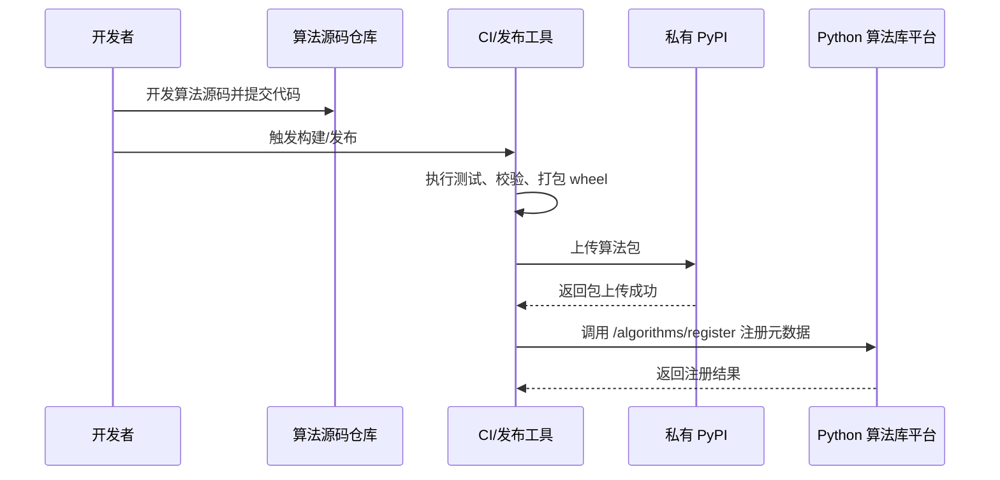
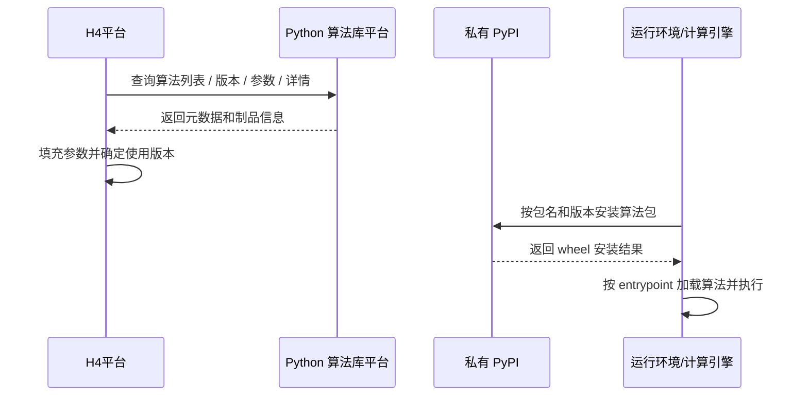

# Python 算法发布与使用流程

## 1. 文档目的

本文档用于说明下面三者之间的关系，以及算法从开发到被使用的完整路径：

- 算法源码仓库
- 私有 PyPI
- Python 算法库平台

这份文档重点回答两个问题：

1. 如果我要提交一个算法，应该怎么提交到私有 PyPI 和算法库平台
2. 如果我要下载一个算法，应该下载源码仓库还是从私有 PyPI 安装

## 2. 先区分三个概念

很多时候“仓库”这个词容易混淆，但这里其实有三种不同职责的地方。

### 2.1 算法源码仓库

例如当前这个仓库：

- [algorithms](d:/02_dicitionary/github/h4/algorithm_repository/algorithms)
- [sdk](d:/02_dicitionary/github/h4/algorithm_repository/sdk)

它的职责是：

- 存放算法源码
- 存放打包配置
- 存放测试代码
- 供开发者 `git clone`、开发、提交、评审

它不是安装源，也不是运行时分发源。

### 2.2 私有 PyPI

私有 PyPI 的职责是：

- 保存打包后的 `wheel`
- 按包名和版本提供安装
- 作为运行环境或平台安装算法包的来源

它不负责源码协作，也不负责算法元数据展示。

### 2.3 Python 算法库平台

当前你在建设的这套平台负责：

- 注册算法元数据
- 管理版本信息
- 提供算法目录查询
- 提供参数、输入输出、描述等展示信息

它不是源码仓库，也不是包分发仓库。

## 3. 一句话理解三者关系

- 源码仓库负责“开发代码”
- 私有 PyPI 负责“发布包”
- 算法库平台负责“登记和查询元数据”

所以一条算法真正发布完成，通常不是只做一步，而是三段式流程：

`开发源码 -> 打包上传私有 PyPI -> 注册到算法库平台`

## 4. 发布算法的完整流程

### 4.1 发布流程时序图



### 4.2 实际动作拆解

如果你要提交一个算法，通常要做下面几步：

1. 在算法源码仓库里新增或修改算法
- 例如放在：
  - [algorithms/algo_missing_value](d:/02_dicitionary/github/h4/algorithm_repository/algorithms/algo_missing_value)
- 补齐：
  - `pyproject.toml`
  - `entry.py`
  - `meta.py`
  - `schema.py`

2. 提交源码到 Git 仓库

```bash
git add .
git commit -m "feat: add missing value algorithm"
git push
```

这一步是“提交源码”，不是“发布包”。

3. 打包算法

一个典型动作会类似这样：

```bash
cd algorithms/algo_missing_value
python -m build
```

打包后通常会生成：

- `dist/algo_missing_value-0.1.0-py3-none-any.whl`

4. 上传到私有 PyPI

典型命令类似：

```bash
twine upload --repository-url <你的私有PyPI地址> dist/*
```

例如：

```bash
twine upload --repository-url http://your-private-pypi/simple dist/*
```

到这一步，说明的是：

- 这个算法包已经能被安装
- 但还没有进入算法库平台的“可查询目录”

5. 注册到算法库平台

上传成功后，再调用算法库平台的注册接口：

- `POST /algorithms/register`

注册内容至少应包含两部分：

- `definition`
  - `code`
  - `name`
  - `version`
  - `entrypoint`
  - `category`
  - `description`
  - `inputs`
  - `outputs`
  - `params`
  - `resources`
  - `requirements`
  - `tags`
- `artifact`
  - `package_name`
  - `package_version`
  - `repository_url`
  - `artifact_type`
  - `filename`
  - `sha256`

也就是说：

- 上传私有 PyPI 是“让包存在”
- 注册到算法库平台是“让平台认识这个算法”

## 5. 下载算法的两种方式

这里要分清楚：你到底是想拿“源码”，还是想拿“可安装包”。

### 5.1 下载源码

如果你是开发者，想查看或修改算法代码，应该下载源码仓库：

```bash
git clone <算法源码仓库地址>
```

下载后，你看到的是源码结构，比如：

- `algorithms/`
- `sdk/`
- `services/`

这种方式适合：

- 开发新算法
- 修改已有算法
- 调试源码
- 提交代码评审

### 5.2 安装算法包

如果你不是要改源码，而是要使用某个算法包，应该从私有 PyPI 安装：

```bash
pip install --index-url <私有PyPI地址>/simple algo-missing-value==0.1.0
```

例如：

```bash
pip install --index-url http://your-private-pypi/simple algo-missing-value==0.1.0
```

这种方式适合：

- 运行环境安装算法
- 调试环境安装指定版本
- 后续引擎或平台按版本拉取算法包

## 6. 使用算法的完整流程

### 6.1 平台使用流程时序图



### 6.2 这里每一层做什么

- Python 算法库平台
  - 告诉你“有哪些算法、有哪些版本、参数怎么填、包在哪里”
- 私有 PyPI
  - 负责真正安装这个包
- 运行环境
  - 根据 `entrypoint` 动态加载算法类并执行

## 7. 你最关心的两个问题，直接回答

### 7.1 如果我想提交某个算法到私有仓库，怎么提？

如果这里的“私有仓库”指的是私有 PyPI，那么不是 `git push`，而是：

1. 在源码仓库开发算法
2. 执行打包
3. 上传 `wheel` 到私有 PyPI
4. 再调用算法库平台注册接口

所以真正完整的发布动作是：

`提交源码 + 上传包 + 注册元数据`

### 7.2 如果我想下载算法仓库，怎么下？

如果你要的是源码：

```bash
git clone <源码仓库地址>
```

如果你要的是安装包：

```bash
pip install --index-url <私有PyPI地址>/simple <package_name>==<version>
```

所以：

- `git clone` 下来的是源码
- `pip install` 下来的是包

## 8. 当前项目与目标流程的关系

需要说明的是，当前仓库里和发布相关的能力还在一期建设中：

- [tools/publish_cli.py](d:/02_dicitionary/github/h4/algorithm_repository/tools/publish_cli.py)
  - 目前还是占位实现
- [docs/algorithm-package-spec.md](d:/02_dicitionary/github/h4/algorithm_repository/docs/algorithm-package-spec.md)
  - 目前还是简要占位

所以本文档描述的是：

- 你这套架构下推荐采用的标准发布/使用流程
- 也是后续 `publish_cli` 和私有 PyPI 接入应该落到的方向

## 9. 推荐的最小落地方式

如果你现在想尽快把流程跑通，我建议最小先做成下面这样：

1. 开发者在 `algorithms/<algo_name>` 下开发算法
2. 手动执行 `python -m build`
3. 手动执行 `twine upload`
4. 手动调用 `POST /algorithms/register`
5. H4 平台通过目录接口查询算法信息

等这条链路稳定以后，再把它逐步收敛成：

- 脚手架工具
- 自动打包脚本
- 自动发布私有 PyPI
- 自动注册平台元数据

## 10. 一句话总结

**源码仓库负责开发，私有 PyPI 负责分发，算法库平台负责登记和查询。**

所以“提交一个算法”不是单一步骤，而是：

**先提交源码，再发布包，最后注册元数据。**
