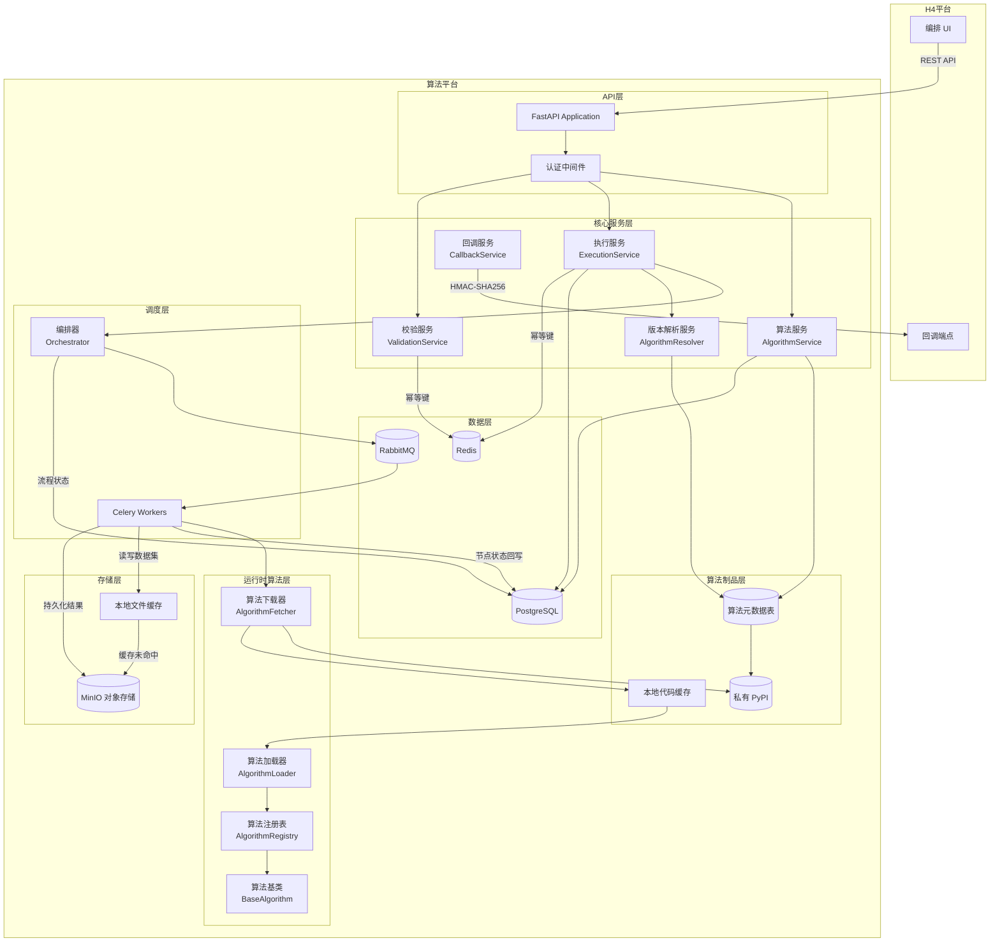
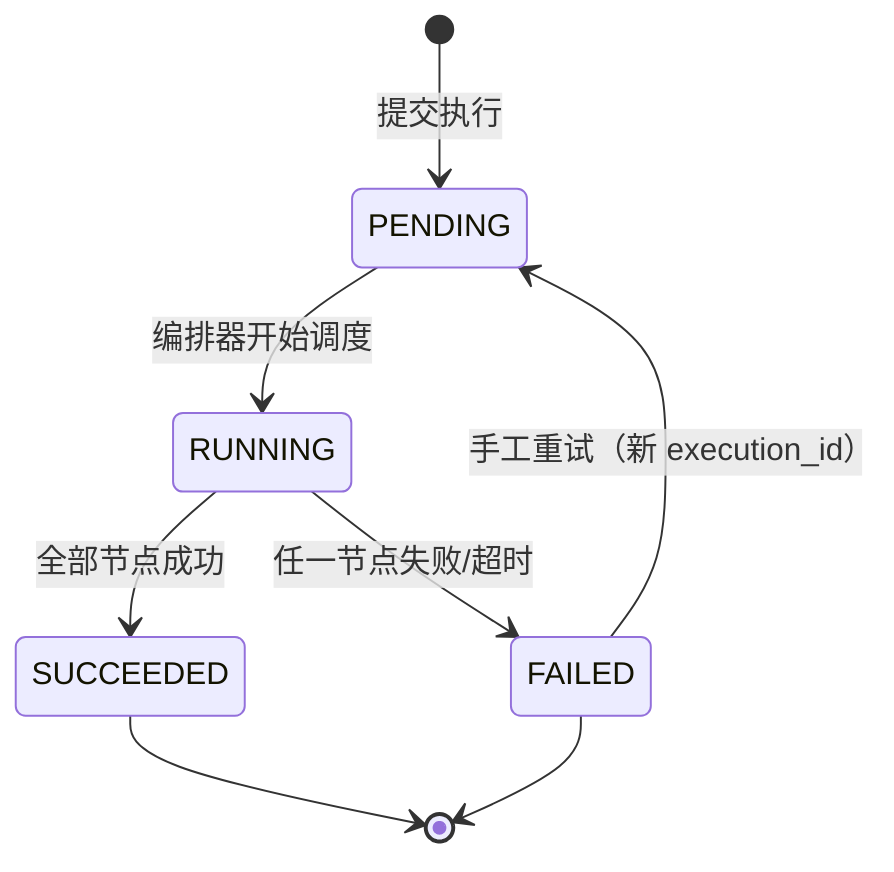
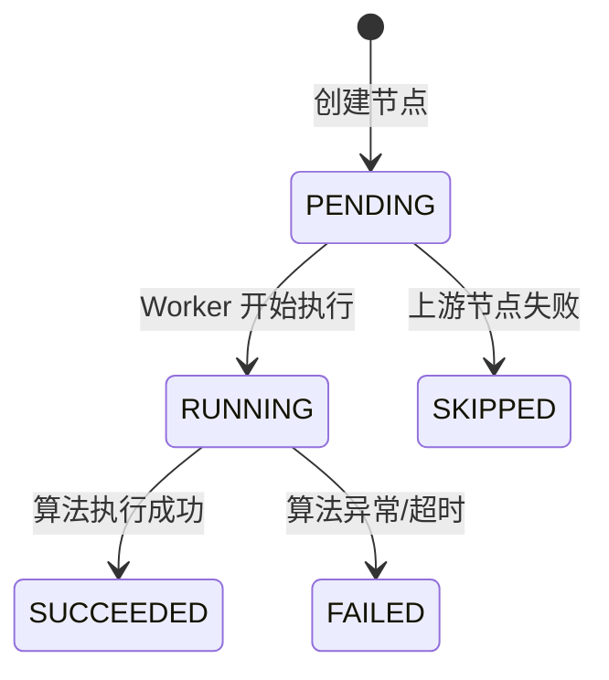
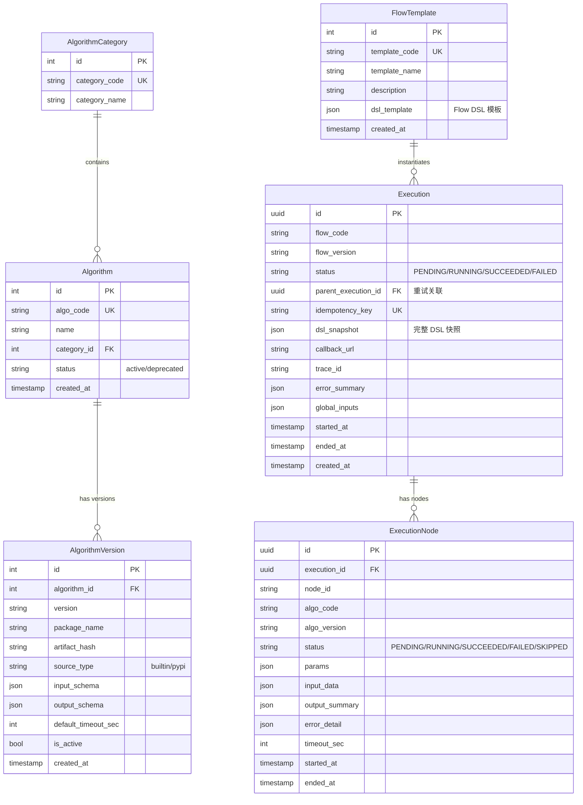
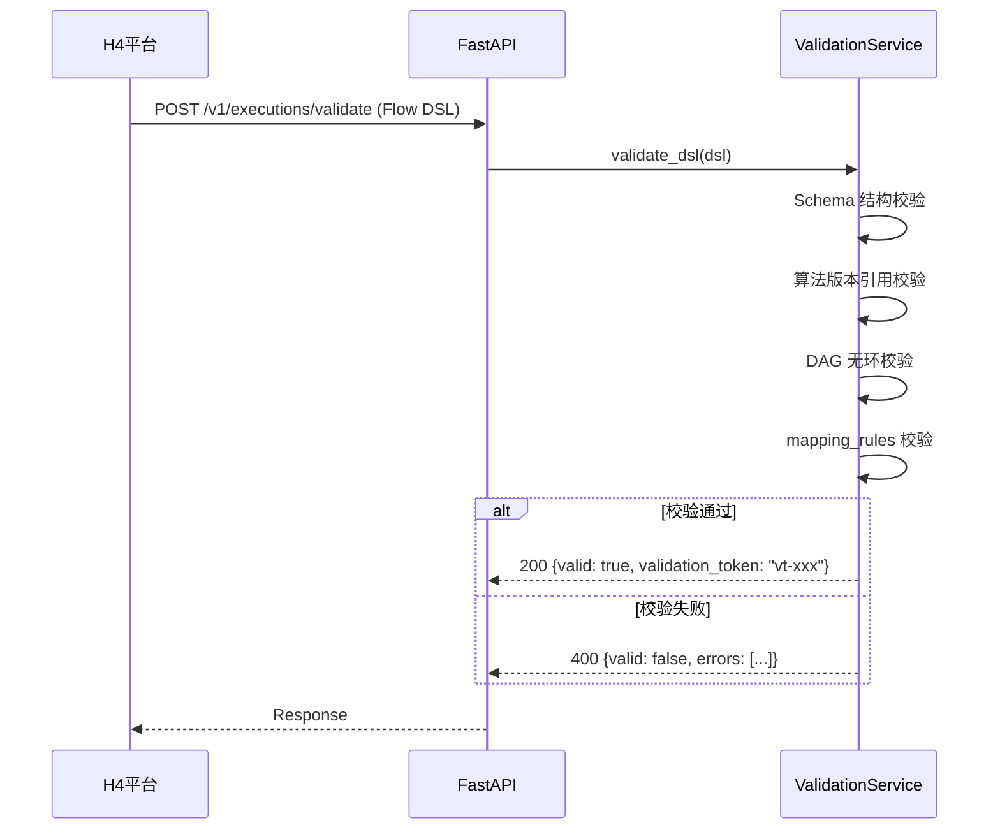
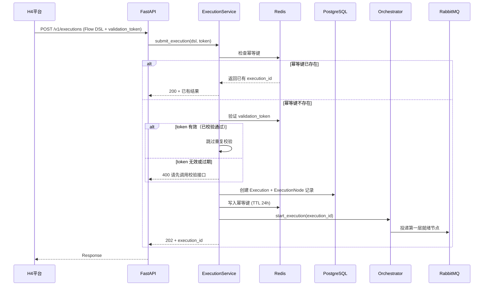
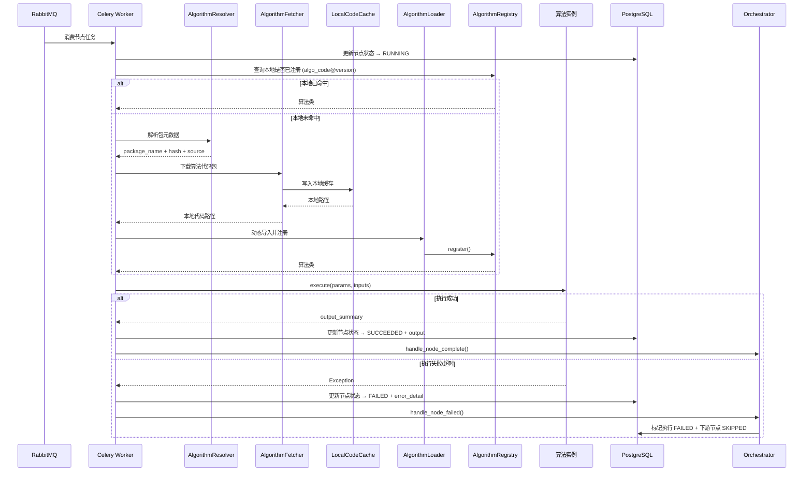
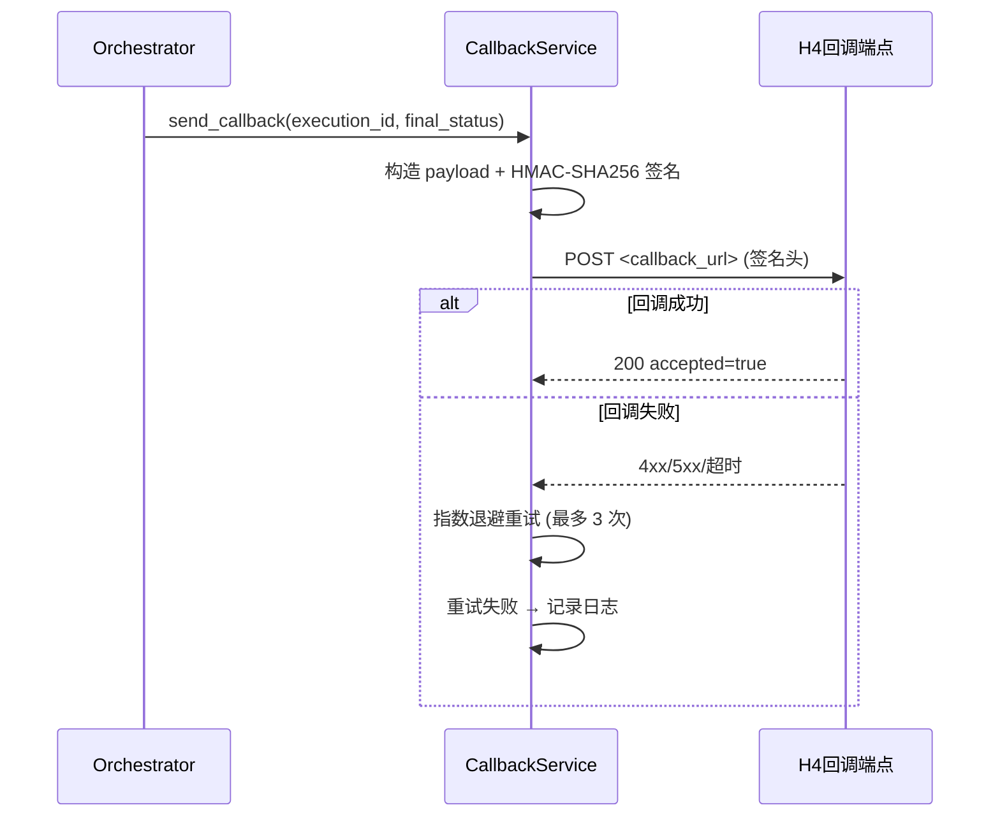
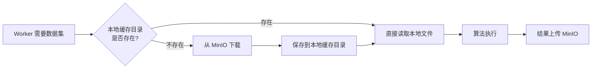

# 算法平台架构设计

**版本：v1.2**
**日期：2026-03-13（更新）**

---

## 1. 项目概述

算法平台是一个独立的后端服务，定位为**算法调度与执行系统**，负责算法目录查询、Flow DSL 校验、DAG 调度执行和结果回调。算法源码本身不再由本系统长期维护，而是由算法团队在独立算法仓库中开发、发布到私有 PyPI；算法平台通过算法元数据与版本映射管理可用算法，并在执行时按需加载算法代码。

### 1.2 职责边界调整（2026-03-13）

1. **算法团队**：负责算法开发、测试、打包、发布、更新和回滚。
2. **算法仓库（私有 PyPI）**：负责算法制品分发，是算法代码的唯一发布源。
3. **算法平台**：负责目录查询、版本解析、执行调度、状态回写、结果回调。
4. **H4 平台**：负责流程编排 UI、参数配置和执行结果展示。

### 1.1 技术栈

| 组件 | 技术选型 | 说明 |
|:---|:---|:---|
| Web 框架 | **FastAPI** | 异步高性能，自带 OpenAPI 文档 |
| 任务队列 | **Celery** | 分布式任务调度，支持 DAG 依赖 |
| 消息代理 | **RabbitMQ** | Celery Broker，消息可靠投递 |
| 数据库 | **PostgreSQL** | 存储算法定义、执行记录等 |
| 缓存 | **Redis** | 幂等键、状态缓存、分布式锁 |
| 对象存储 | **MinIO** | 数据集存储，兼容 S3 协议 |
| ORM | **SQLAlchemy 2.0** + **Alembic** | 异步 ORM + 数据库迁移 |
| 序列化 | **Pydantic v2** | 请求/响应模型，JSON Schema 校验 |

---

## 2. 系统架构总览



---

## 3. 项目目录结构

```
algorithm_repository/
├── alembic/                          # 数据库迁移
│   ├── versions/
│   └── env.py
├── app/
│   ├── __init__.py
│   ├── main.py                       # FastAPI 入口
│   ├── config.py                     # 配置管理（Pydantic Settings）
│   │
│   ├── api/                          # API 路由层
│   │   ├── __init__.py
│   │   ├── deps.py                   # 依赖注入（DB session、认证等）
│   │   └── v1/
│   │       ├── __init__.py
│   │       ├── router.py             # v1 总路由
│   │       ├── algorithms.py         # 算法库相关接口
│   │       └── executions.py         # 执行相关接口
│   │
│   ├── schemas/                      # Pydantic 请求/响应模型
│   │   ├── __init__.py
│   │   ├── algorithm.py              # 算法相关 Schema
│   │   ├── execution.py              # 执行相关 Schema
│   │   ├── flow_dsl.py               # Flow DSL 结构定义
│   │   └── callback.py               # 回调相关 Schema
│   │
│   ├── models/                       # SQLAlchemy ORM 模型
│   │   ├── __init__.py
│   │   ├── algorithm.py              # Algorithm, AlgorithmVersion
│   │   ├── execution.py              # Execution, ExecutionNode
│   │   └── template.py               # FlowTemplate（算法模板）
│   │
│   ├── services/                     # 业务逻辑层
│   │   ├── __init__.py
│   │   ├── algorithm_service.py      # 算法 CRUD
│   │   ├── algorithm_catalog_service.py # 算法目录查询 + 元数据同步
│   │   ├── algorithm_resolver.py     # algo_code/version -> 包信息解析
│   │   ├── algorithm_fetcher.py      # 私有 PyPI 下载 + 哈希校验
│   │   ├── algorithm_loader.py       # 动态导入 + 运行时注册
│   │   ├── execution_service.py      # 执行生命周期管理
│   │   ├── validation_service.py     # DSL 校验 + DAG 校验
│   │   ├── callback_service.py       # 回调发送 + 重试
│   │   ├── storage_service.py        # MinIO + 本地缓存管理
│   │   └── template_service.py       # 流程模板管理
│   │
│   ├── engine/                       # 调度引擎
│   │   ├── __init__.py
│   │   ├── orchestrator.py           # DAG 编排器（拓扑排序、依赖调度）
│   │   ├── dag.py                    # DAG 数据结构与无环校验
│   │   └── tasks.py                  # Celery 任务定义
│   │
│   ├── algorithms/                   # 兼容期内置算法与基础契约（长期不再作为主算法来源）
│   │   ├── __init__.py
│   │   ├── base.py                   # BaseAlgorithm 基类 (含 execution_mode)
│   │   ├── registry.py               # 运行时算法注册表（本地优先，缺失可动态补齐）
│   │   ├── _algo_template.py         # 算法开发模板
│   │   ├── data_cleaning/            # 数据清洗
│   │   │   ├── missing_value.py      # 缺失值处理
│   │   │   └── outliers.py           # 异常值检测与处理
│   │   ├── data_processing/          # 数据处理
│   │   │   ├── standardize.py        # 数据标准化
│   │   │   ├── alignment.py          # 数据对齐
│   │   │   ├── sampling.py           # 数据采样
│   │   │   └── filter.py             # 数据滤波
│   │   ├── task_scheduling/          # 任务排程
│   │   │   ├── rule_fast.py          # 规则快速排程
│   │   │   ├── rule_solver.py        # 规则求解器精准排程
│   │   │   └── ga_heuristic.py       # GA启发式排程优化
│   │   ├── quality_spc/              # 质量SPC
│   │   │   ├── control_limit.py      # 控制限计算
│   │   │   ├── process_capability.py # 过程能力指数计算
│   │   │   └── anomaly_rules.py      # 判异/失控规则计算
│   │   └── quality_prediction/       # 质量预测
│   │       └── heat_treatment.py     # 热处理工艺质量预测
│   │
│   └── core/                         # 公共基础设施
│       ├── __init__.py
│       ├── database.py               # 数据库连接管理
│       ├── redis.py                  # Redis 连接管理
│       ├── minio_client.py           # MinIO 客户端
│       ├── package_cache.py          # 算法代码缓存管理
│       ├── celery_app.py             # Celery 实例配置
│       ├── security.py               # API Key 认证、HMAC 签名
│       ├── exceptions.py             # 自定义异常
│       └── logging.py                # 日志配置
│
├── tests/                            # 测试
│   ├── conftest.py
│   ├── test_api/
│   ├── test_services/
│   ├── test_engine/
│   └── test_algorithms/
│
├── alembic.ini
├── pyproject.toml
├── docker-compose.yml                # 本地开发环境
├── Dockerfile
└── README.md
```

---

## 4. 核心模块设计

### 4.1 算法基类与注册表

```python
# app/algorithms/base.py
from abc import ABC, abstractmethod
from pydantic import BaseModel
from typing import Any, Dict, Type

class AlgorithmMeta(BaseModel):
    """算法元数据"""
    algo_code: str                    # 唯一编码
    name: str                         # 显示名称
    category: str                     # 所属类别
    version: str                      # 版本号
    input_schema: dict                # JSON Schema
    output_schema: dict               # JSON Schema
    default_timeout_sec: int = 60

class BaseAlgorithm(ABC):
    """所有算法的基类"""
    meta: AlgorithmMeta               # 子类必须定义

    @abstractmethod
    def execute(self, params: Dict[str, Any], inputs: Dict[str, Any]) -> Dict[str, Any]:
        """
        执行算法
        Args:
            params: 算法参数（如 strategy, method 等）
            inputs: 上游节点传入的数据（如 dataset_ref）
        Returns:
            输出结果字典，需符合 output_schema
        """
        ...

    def validate_params(self, params: Dict[str, Any]) -> None:
        """参数校验（可选覆写）"""
        ...
```

```python
# app/algorithms/registry.py
class AlgorithmRegistry:
    """算法注册表 — 自动发现并注册所有算法实现"""
    _registry: Dict[str, Dict[str, Type[BaseAlgorithm]]] = {}

    @classmethod
    def register(cls, algo_class: Type[BaseAlgorithm]):
        """装饰器方式注册算法"""
        meta = algo_class.meta
        key = f"{meta.algo_code}@{meta.version}"
        cls._registry[key] = algo_class
        return algo_class

    @classmethod
    def get(cls, algo_code: str, version: str) -> Type[BaseAlgorithm]:
        """获取算法类"""
        key = f"{algo_code}@{version}"
        if key not in cls._registry:
            raise AlgorithmNotFoundError(algo_code, version)
        return cls._registry[key]

    @classmethod
    def list_all(cls, category: str = None, status: str = "active"):
        """按类别列出所有已注册算法"""
        ...
```

### 4.1.1 方案A：本地优先，缺失时动态加载

在 v1.2 方案中，`AlgorithmRegistry` 不再只承担“启动时扫描本地源码”的职责，而是配合 `AlgorithmResolver + AlgorithmFetcher + AlgorithmLoader` 形成“本地优先，缺失时下载”的运行时算法加载机制。

```python
class AlgorithmResolver:
    """根据 algo_code@version 解析算法包元数据"""
    async def resolve(self, algo_code: str, version: str) -> dict:
        """
        返回:
        {
            "package_name": "algo-missing-value",
            "version": "1.0.0",
            "artifact_url": "https://pypi.example/simple/...",
            "artifact_hash": "sha256:..."
        }
        """
        ...


class AlgorithmLoader:
    """当本地未命中时，负责下载、缓存、动态导入并注册算法"""
    async def ensure_loaded(self, algo_code: str, version: str) -> Type[BaseAlgorithm]:
        """
        1. 检查注册表是否已存在
        2. 若不存在，则解析包信息
        3. 下载到本地缓存目录
        4. 动态导入 entry 模块
        5. 触发运行时注册
        """
        ...
```

### 4.2 DAG 引擎

```python
# app/engine/dag.py
from collections import deque
from typing import List, Dict, Set

class DAGNode:
    node_id: str
    algo_code: str
    algo_version: str
    params: dict
    timeout_sec: int
    dependencies: Set[str]      # 前置节点 ID 集合

class DAG:
    """有向无环图"""
    nodes: Dict[str, DAGNode]
    edges: List[tuple]

    def validate_no_cycle(self) -> bool:
        """Kahn 算法检测环"""
        ...

    def topological_sort(self) -> List[List[str]]:
        """拓扑排序，返回按层分组的节点 ID
        同一层的节点可以并行执行
        例如: [['n1'], ['n2', 'n3'], ['n4']]
        """
        ...
```

```python
# app/engine/orchestrator.py
class Orchestrator:
    """DAG 编排器 — 管理执行实例的生命周期"""

    async def start_execution(self, execution_id: str, dsl: FlowDSL):
        """启动执行：解析 DSL → 构建 DAG → 按拓扑序调度"""
        dag = self._build_dag(dsl)
        layers = dag.topological_sort()

        for layer in layers:
            # 同一层并行投递 Celery 任务
            chord = group(
                execute_node.s(execution_id, node_id)
                for node_id in layer
            )
            result = chord.apply_async()
            # 等待当前层全部完成后，再调度下一层
            result.get(timeout=max_timeout)

    async def handle_node_complete(self, execution_id, node_id, status, output):
        """节点完成回调 — 更新状态、检查是否所有节点完成"""
        ...

    async def handle_node_failed(self, execution_id, node_id, error):
        """节点失败 — 标记执行 FAILED，停止下游调度"""
        ...
```

### 4.3 执行状态机



**节点状态：**



### 4.4 数据模型（SQLAlchemy）



---

## 5. API 接口设计

### 5.1 路由总览

| 路由 | 方法 | 说明 |
|:---|:---|:---|
| `/v1/algorithms` | GET | 按类别获取算法目录（来源于元数据表/私有算法仓映射） |
| `/v1/algorithms/{algo_code}/versions/{version}` | GET | 获取算法版本 Schema 与包元数据 |
| **`/v1/executions/validate`** | **POST** | **预校验 Flow DSL（必须先调用）** |
| **`/v1/executions`** | **POST** | **提交执行（仅校验通过后调用）** |
| `/v1/executions/{execution_id}` | GET | 查询流程状态 |
| `/v1/executions/{execution_id}/nodes` | GET | 查询节点明细 |
| `/v1/executions/{execution_id}/retry` | POST | 手工整流程重试 |
| `/v1/templates` | GET | 获取流程编排模板列表 |
| `/v1/templates/{template_code}` | GET | 获取模板详情 |

> [!IMPORTANT]
> **校验与执行拆分为两个独立接口**：H4 平台必须先调用 `/v1/executions/validate` 进行 DSL 预校验，校验通过后再调用 `/v1/executions` 提交执行。这样避免了直接执行失败后的高代价回滚。

### 5.2 认证机制

因为两个系统都是公司内部系统，采用最简单的 **API Key** 方式：

- H4 平台调用算法平台：请求头 `X-API-Key: <shared_secret>`
- 算法平台回调 H4 平台：**HMAC-SHA256 签名**（`X-Signature` + `X-Timestamp`），保证回调不可伪造
- API Key 由算法平台生成并分发给 H4 平台，配置在环境变量中

### 5.3 幂等机制

- 提交执行时通过 `Idempotency-Key` 请求头实现幂等
- Redis 存储幂等键，TTL 24 小时
- 相同幂等键重复提交时返回已有 `execution_id`

---

## 6. 关键流程

### 6.1 预校验流程（先校验）



> [!NOTE]
> 校验通过后返回 `validation_token`（Redis 缓存，TTL 30 分钟），提交执行时携带该 token 可跳过重复校验，提升效率。

### 6.2 执行提交流程（再执行）



### 6.3 节点执行流程



### 6.4 回调流程



## 7. 算法与算子的统一（平级注册与智能合并调度）

针对“缺失值处理”、“特征过滤”这类极其轻量、却又需要在前端自由连线组合的**小算子**，为了兼顾“对外逻辑平齐”与“内部执行极速”，系统采取如下特殊编排设计：

### 7.1 元数据彻底平级化 (暴露给所有前端应用)
系统内不设外壳大节点（如 CompositeNode）。所有的算子（无论是简单的 `df.fillna` 还是复杂的 `ModelTrain`），**全部作为一等公民继承 `BaseAlgorithm` 并注册到同一个 `AlgorithmRegistry` 中心池**。在 v1.2 方案中，这个注册行为既可以来自本地兼容算法，也可以来自私有 PyPI 下载后的动态导入。

为了区分性能开销，在 `AlgorithmMeta` 中新增 `execution_mode` 标识：
* `execution_mode = "in_memory"`：纯数据帧映射，如缺失值、标准化、过滤。
* `execution_mode = "celery_task"`：重型耗时任务，如模型搜索、大规模训练。

当前端请求 `GET /v1/algorithms` 时，可以直接获取到扁平化的结构树图，前端画布中每个小操作都可以被视为独立的标准算法节点进行连线。

### 7.2 Orchestrator 引擎的动态打包压缩 (避免 IO 风暴)
由于每个算法节点本应被拆分为独立 Celery 任务、且执行前后都要落盘 MinIO，如果让三个轻量数据算子串行独立执行，会导致极差的读写性能。

因此，**执行引擎(Orchestrator)** 在下发任务建立真实 DAG 时，会进行一次 **“智能打包”**（图融合优化）：
1. 遍历待执行的 DAG。
2. 如果发现有连续多个连线的节点，其 `execution_mode` 均为 `in_memory`（例如：读取 -> 过滤 -> 标准化），则编排器**在底层将其打包压缩成一个单一的复合 Celery 任务**发往下游。
3. Celery Worker 收到这个压缩任务后，在内部利用 Pandas 在**单次内存流转中将这些算法瞬间跑完**，只需进行最后一次 MinIO 上传。

这种模式达成了：**“UI 交互自由组合无限制，底层调度偷偷内联保性能”**的极致体验。

---

## 8. 节点数据传递（Mapping Rules）

节点之间的数据通过 `mapping_rules` 传递：

```json
{
  "from_node": "n1",
  "to_node": "n2",
  "mapping_rules": [
    { "from": "n1.output.dataset_ref", "to": "n2.input.dataset_ref" }
  ]
}
```

**执行时的解析逻辑：**
1. 当 `n1` 执行成功后，将 `output_summary` 存入数据库
2. 调度 `n2` 时，编排器根据 `mapping_rules` 从 `n1` 的 `output_summary` 中提取 `dataset_ref`
3. 注入到 `n2` 的 `input_data` 中
4. 如果流程有 `global_inputs`（如初始 `dataset_ref`），优先级：`mapping_rules` > `global_inputs`

---

## 9. 已确认的设计决策

| # | 决策项 | 结论 |
|:--|:---|:---|
| 1 | **数据存储** | **MinIO**（兼容 S3 协议），`dataset_ref` 即 MinIO 地址。本地文件系统作为缓存：Worker 执行时先查看本地固定目录，未命中则从 MinIO 下载并保留本地副本 |
| 2 | **部署方式** | 暂不关注，由公司运维人员负责部署 |
| 3 | **认证方式** | 内部系统间采用 **API Key**（`X-API-Key` 请求头），简单高效 |
| 4 | **算法模板** | **一期支持**，提供示例模板（如时序数据质量诊断模板），返回测试数据即可 |
| 5 | **校验与执行** | **拆分为两个独立接口**：`/v1/executions/validate`（预校验）+ `/v1/executions`（提交执行） |
| 6 | **统一算子架构** | **平级注册与引擎图融合**：算子与算法平级暴露给前端。执行引擎根据算法的 `execution_mode` 将连续的轻量级 (`in_memory`) 节点在底层自动融合成一个单一 Celery 任务执行，极速省流。 |
| 7 | **算法维护职责** | **外移到独立算法仓库**，算法平台不再长期维护算法源码，仅维护目录、版本与执行控制 |
| 8 | **算法获取策略** | **本地优先，缺失时从私有 PyPI 下载并动态注册** |
| 9 | **依赖策略** | **当前阶段共享一套基础依赖环境**，仅下载算法代码本身，不为每个算法创建独立依赖环境 |

### 9.1 数据集存储策略



- **本地缓存目录**：`/data/algorithm_cache/`（可配置）
- **MinIO Bucket**：`algorithm-datasets`（数据集）、`algorithm-results`（执行结果）

---

## 10. 一期实现范围

根据 `project_plane.md` 中的工作计划，一期聚焦：

### 必须交付
- [x] 算法目录查询 API
- [x] 算法版本 Schema 查询 API
- [x] Flow DSL 预校验 API
- [x] 执行提交 API（含幂等）
- [x] DAG 调度引擎（拓扑排序 + Celery Worker）
- [x] 执行状态查询 + 节点明细查询 API
- [x] 手工整流程重试 API
- [x] 回调发送（HMAC 签名 + 重试）
- [x] 首批算法实现（时序预处理 + 时序特征工程 + 异常检测）
- [x] 算法元数据维护（algo_code/version -> package_name/hash/source）
- [x] Worker 端算法解析、下载、缓存、动态注册能力
- [x] 本地内置算法与外部算法双通道兼容

### 非一期目标
- 算法平台自有编排 UI
- 补偿事务 / 跳过节点 / 降级策略
- 算法热加载 / 动态插件
- 每个算法包独立依赖环境
- 文本/NLP 和 CV 类算法（二期）

---

## 11. 算法模板示例（一期）

一期提供一个**时序数据质量诊断模板**作为示例，模板 API 返回模板 DSL 结构，H4 平台加载后供用户填充具体算法。

### 模板 DSL 示例

```json
{
  "template_code": "tpl_ts_quality_diagnosis_v1",
  "template_name": "时序数据质量诊断模板",
  "description": "包含预处理→降噪→特征工程→异常检测四个步骤的标准流程",
  "dsl_template": {
    "nodes": [
      {
        "node_id": "n1_clean",
        "step_name": "时序预处理",
        "category": "ts_preprocessing",
        "algo_code": null,
        "algo_version": null,
        "default_params": { "missing_strategy": "linear_interp" },
        "timeout_sec": 60
      },
      {
        "node_id": "n2_denoise",
        "step_name": "平滑降噪",
        "category": "ts_preprocessing",
        "algo_code": null,
        "algo_version": null,
        "default_params": { "method": "savgol", "window": 11 },
        "timeout_sec": 60
      },
      {
        "node_id": "n3_features",
        "step_name": "特征工程",
        "category": "ts_feature",
        "algo_code": null,
        "algo_version": null,
        "default_params": { "features": ["mean", "rms", "kurtosis"] },
        "timeout_sec": 90
      },
      {
        "node_id": "n4_anomaly",
        "step_name": "异常检测",
        "category": "ts_anomaly",
        "algo_code": null,
        "algo_version": null,
        "default_params": { "method": "zscore", "threshold": 3 },
        "timeout_sec": 90
      }
    ],
    "edges": [
      { "from_node": "n1_clean", "to_node": "n2_denoise", "mapping_rules": [] },
      { "from_node": "n2_denoise", "to_node": "n3_features", "mapping_rules": [] },
      { "from_node": "n3_features", "to_node": "n4_anomaly", "mapping_rules": [] }
    ]
  }
}
```

> [!NOTE]
> 模板中 `algo_code` 和 `algo_version` 为 `null`，表示由用户在 H4 平台的编排 UI 中选择具体算法填充。`category` 字段用于过滤该节点可选的算法范围。
