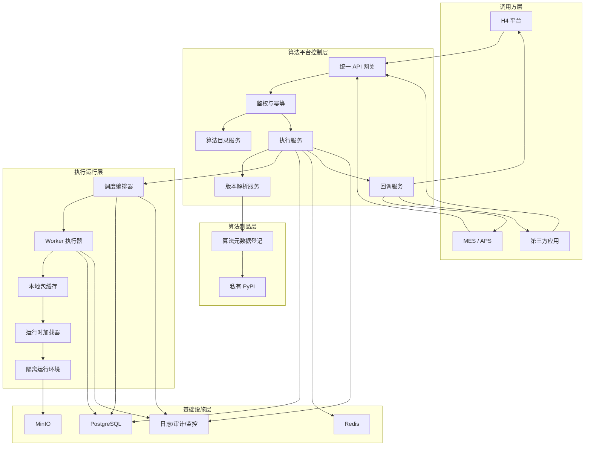
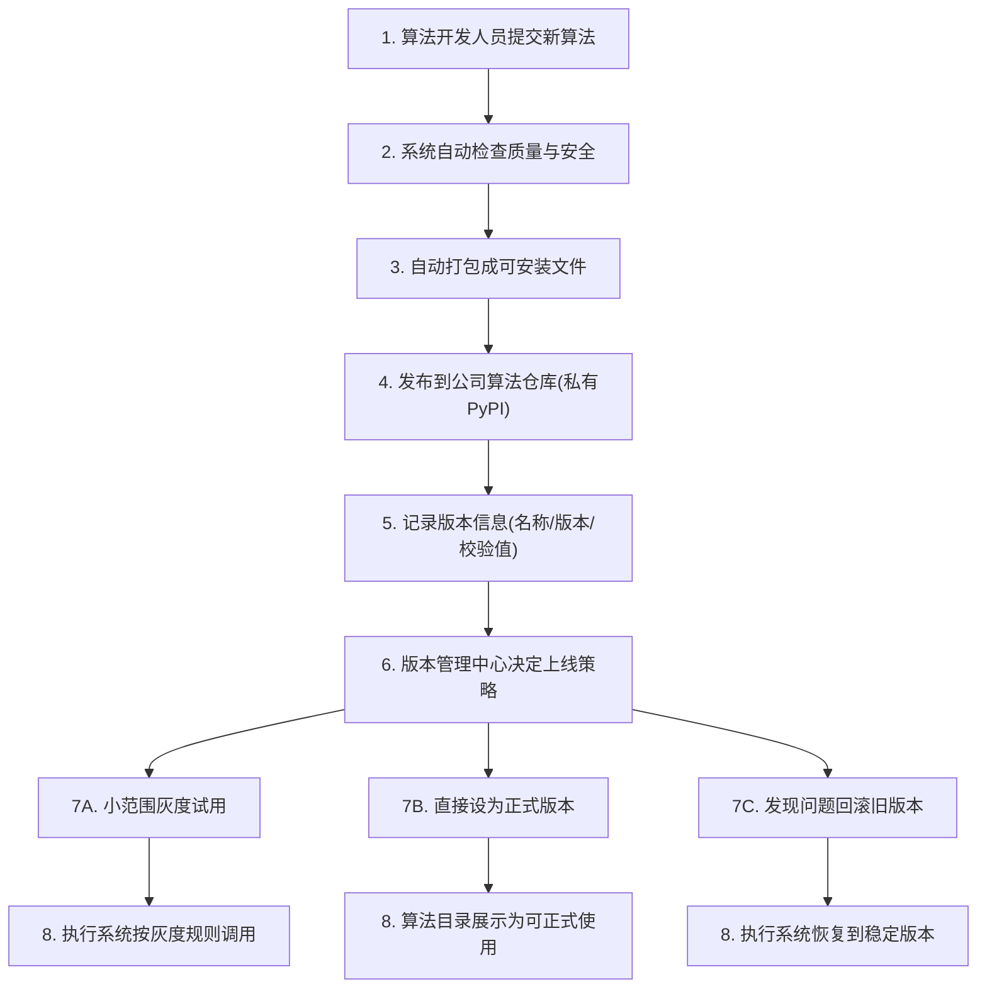
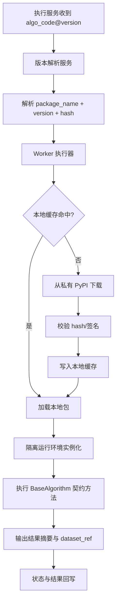
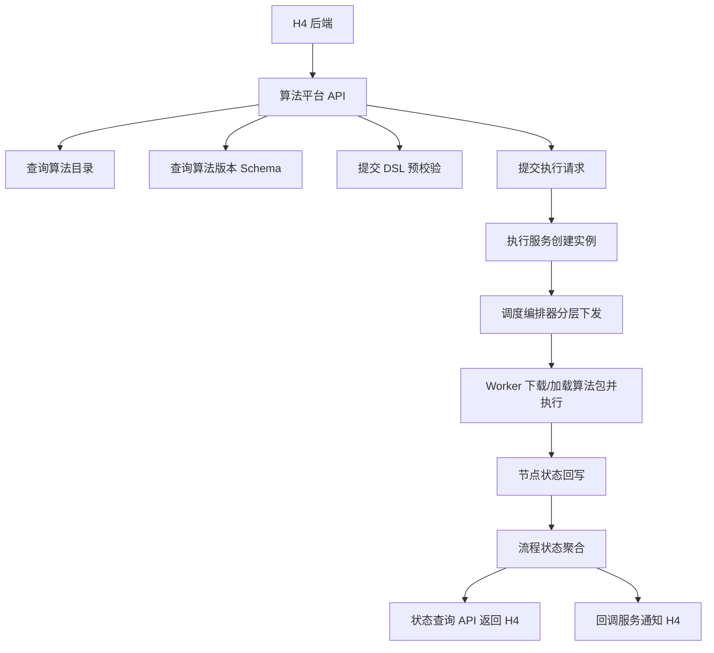
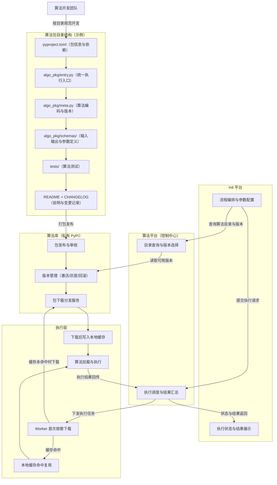
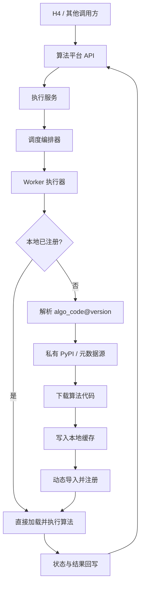

# 算法库独立化专题设计附件（私有 PyPI 方案）

**版本**: v1.1  
**日期**: 2026-03-13  
**状态**: 专题设计附件（主设计以 `2026-03-09-algorithm-platform-architecture-design.md` 为准）  
**适用场景**: 补充说明算法仓库、私有 PyPI、发布治理与专题架构图

---

## 1. 设计目标

1. 将算法库从当前 `app/algorithms` 的仓内耦合形态，提升为“可发布、可版本管理、可下载执行”的独立资产。
2. 采用私有 PyPI 标准化管理算法包，降低后续迁移成本。
3. 执行侧采用“首次按需下载 + 本地缓存”的策略，平衡性能和复杂度。
4. 兼容多调用方（H4/MES/APS/第三方），H4 只是一个接入方。
5. 当前系统定位收敛为“算法调度与执行系统”，算法维护职责外移到专门的算法仓库。

---

## 2. 总体架构图（平台视角）



---

## 3. 算法包发布与更新架构图（领导汇报通俗版）



---

## 4. 下载执行与本地缓存架构图（运行视角）



---

## 5. H4 调用算法库逻辑图（专项汇报视角）



---

## 6. 关键设计决策（汇报可直接读）

1. **私有 PyPI 作为算法制品唯一分发源**  
   算法发布、更新、回滚全部围绕标准 Python 包管理。

2. **控制面与数据面解耦**  
   平台只负责“版本解析与执行控制”，Worker 负责“下载加载与执行”。

3. **首次按需下载 + 本地缓存**  
   冷启动可控，后续重复执行不重复下载。

4. **版本策略可控**  
   支持激活、灰度、回滚三种策略，不强制新版本覆盖旧流程。

5. **H4 先校验后执行**  
   保持 `validate` 与 `execute` 分离，降低错误 DSL 进入执行面的风险。

---

## 7. 领导常问问题与标准回答

1. **为什么要拆成私有 PyPI？**  
   标准化最好，后续扩容、复用、审计、回滚都更低成本。

2. **会不会拖慢执行？**  
   不会。首次下载后本地缓存命中，执行时延接近本地算法。

3. **多系统接入是否会变复杂？**  
   不会。接入方统一走 API，算法包治理在平台内部完成。

4. **如何避免新版本事故？**  
   用版本策略中心控制灰度与回滚，不直接全量切换。

---

## 8. H4 平台与算法库逻辑图（含目录结构设计）



配文（可直接用于汇报）：

该方案将“算法开发、算法发布、算法执行”三件事彻底解耦。算法研发团队按统一目录规范开发并发布到私有 PyPI；算法平台只负责目录与版本策略、执行调度和结果汇总；执行节点按“首次下载、本地缓存复用”方式运行。这样既能让领导关注的目录结构标准化落地，也能保证版本可控、更新可回滚、执行性能稳定。

---

## 9. 算法仓库目录（仅私有 PyPI 源）

下面目录仅描述“算法仓库”本身，不包含算法平台服务代码：

```text
algorithm-pypi-repo/                     # 算法仓库
├── README.md                            # 仓库说明
├── docs/
│   ├── package-standard.md              # 算法包开发规范
│   ├── release-process.md               # 发布流程
│   └── version-policy.md                # 版本策略
│
├── registry/
│   ├── algorithms.yaml                  # 算法目录清单
│   ├── categories.yaml                  # 算法分类定义
│   └── compatibility.yaml               # 兼容性约束
│
├── packages/
│   ├── common/                          # 公共基础
│   ├── missing-value/                   # 缺失值处理算法
│   │   ├── README.md
│   │   ├── src/
│   │   │   └── algo_missing_value/
│   │   │       ├── entry.py            # 统一执行入口
│   │   │       ├── meta.py             # algo_code/version/category
│   │   │       ├── schemas/
│   │   │       │   ├── input_schema.json
│   │   │       │   ├── output_schema.json
│   │   │       │   └── param_schema.json
│   │   │       └── impl/
│   │   │           └── algorithm.py    # 算法实现
│   │   └── tests/
│   │       └── test_algorithm.py
│
├── scripts/
│   ├── build_all.ps1                    # 批量构建
│   ├── publish_all.ps1                  # 批量发布
│   └── validate_registry.py             # 校验目录映射
│
└── tests/                                 
    └── test_package_build.py            # 仓库级完整性校验
```

配文（目录说明）：

该仓库本质上是“算法包资产仓”，不是算法平台本身。核心分为四部分：`packages/` 存放各算法包，`registry/` 维护算法目录与版本映射，`docs/` 定义开发与发布规范，`.github/workflows/` 与 `scripts/` 负责构建和发布到私有 PyPI。这样设计后，算法可以像标准 Python 包一样被发布、更新、下载和回滚。

---

## 10. PPT 精简目录树

用于汇报时，建议只展示下面这版：

```text
algorithm-pypi-repo/
├── packages/                   # 算法包主体
│   ├── common/                 # 公共基础能力
│   ├── missing-value/          # 缺失值处理算法包
│   ├── outliers-detection/     # 异常值处理算法包
│   └── standardize/            # 标准化算法包
│
├── registry/                   # 算法目录与版本映射
│   ├── algorithms.yaml
│   └── categories.yaml
│
├── docs/                       # 开发规范与发布规范
│   ├── package-standard.md
│   └── release-process.md
│
└── .github/workflows/          # 自动构建与发布
    ├── ci.yml
    └── publish.yml
```

配文（PPT 精简版）：

PPT 展示时，只需要突出四个核心部分：`packages/` 表示算法资产本体，`registry/` 表示目录与版本管理，`docs/` 表示研发和发布规范，`.github/workflows/` 表示自动化构建与发布能力。这样既能体现算法仓库是标准化资产仓，也不会因为目录过细影响领导阅读。

---

## 11. 方案A迁移原则（当前系统基本不变）

方案A的核心原则是：**算法维护职责外移，调度系统保留主干，只在算法加载链路上增强“缺失即下载”能力。**

1. 算法仓库由算法团队独立维护，当前系统不再负责算法源码开发与发布。
2. 当前系统继续负责目录展示、版本选择、DSL 校验、DAG 调度、执行状态回写、结果回调。
3. 执行时默认先查本地已注册算法；若本地不存在，再从私有 PyPI 下载代码并动态加载。
4. 所有算法暂时共享一套基础依赖环境，只下载算法代码本身，不为每个算法创建独立依赖环境。

---

## 12. 模块改动边界

### 12.1 基本不动的模块

1. H4 对接方式基本不变：目录查询、版本详情、预校验、提交流程、状态查询、回调通知仍保留。
2. Flow DSL 结构基本不变：继续使用 `algo_code + algo_version` 标识算法节点。
3. 调度编排器基本不变：DAG 构建、拓扑分层、Bundling 优化逻辑保留。
4. 执行模型基本不变：Worker 仍然按节点执行算法并回写状态。

### 12.2 必须改动的模块

1. **算法注册表**：从“启动时扫描本地源码”增强为“本地优先，缺失时动态下载并注册”。
2. **Worker 执行入口**：执行前需确保目标算法已存在于本地运行环境。
3. **算法目录来源**：目录与详情不能再完全依赖本地 import 结果，需要引入元数据映射。
4. **本地缓存管理**：新增算法代码缓存目录、版本命中与失效策略。

### 12.3 需要新增的模块

1. `AlgorithmResolver`：负责根据 `algo_code@version` 解析包名、版本、下载地址、哈希值。
2. `AlgorithmFetcher`：负责从私有 PyPI 下载算法代码包。
3. `AlgorithmLoader`：负责动态导入下载后的算法代码并注册到 `AlgorithmRegistry`。
4. `AlgorithmCatalogSync`：负责同步算法目录元数据，供“算法列表/算法详情”接口查询。

---

## 13. 方案A执行链路图（迁移后）



配文（迁移链路说明）：

迁移后，当前系统的主执行链路不发生结构性变化，只是在 Worker 执行前增加“算法解析、按需下载、动态注册”三个步骤。本地已有算法时直接执行；本地缺失时才访问私有 PyPI 下载并缓存，因此既保留了现有调度体系，又实现了算法维护职责外移。

---

## 14. 改动量评估

| 领域 | 改动量 | 说明 |
|:---|:---|:---|
| H4 接口与调用流程 | 低 | API 路由和交互模式基本可保持不变 |
| Flow DSL | 低 | 继续使用 `algo_code + algo_version` |
| DAG 编排与 Bundling | 低 | 编排逻辑基本保留 |
| Worker 执行链路 | 中 | 增加算法解析、下载、缓存、动态加载 |
| 算法注册与目录服务 | 中 | 从本地扫描改为“本地 + 外部元数据”双来源 |
| 发布治理链路 | 中 | 需要补私有 PyPI、元数据登记和版本策略 |
| 依赖隔离与环境治理 | 低 | 当前阶段不做独立依赖环境，复杂度可控 |

**总体判断：**  
这不是小修小补，但也不是推倒重来。按方案A落地，整体属于**中等改动量**，核心是给当前执行系统补齐“算法外部化加载”能力，而不是重构整个调度平台。

---

## 15. 分阶段落地建议

### 第一阶段：最小可用改造

1. 增加算法目录元数据源。
2. 增加 `Resolver + Fetcher + Loader` 三个能力。
3. Worker 在算法缺失时自动下载并注册。
4. 保持现有本地算法目录可继续运行，形成新旧双通道兼容。

### 第二阶段：目录与治理切换

1. 算法列表与版本详情接口改为优先读取元数据源。
2. 引入激活、灰度、回滚等版本策略。
3. 引入缓存清理和包校验机制。

### 第三阶段：彻底职责收敛

1. 当前系统不再维护算法源码实现，只保留基础契约与执行框架。
2. 算法团队仅在算法仓库中开发、发布和维护算法。

---

## 16. 风险与注意事项

1. **动态加载失败风险**：包结构不规范、入口类不一致会导致加载失败，因此必须先统一算法包规范。
2. **目录与实际包不一致风险**：元数据映射错误会导致 Worker 找不到正确算法包，因此要加发布校验。
3. **缓存一致性风险**：包已更新但缓存未失效会导致执行版本错乱，因此需要明确缓存命中与清理策略。
4. **共享依赖环境风险**：当前阶段虽然降低了复杂度，但也要求算法团队遵守基础依赖边界，避免引入冲突库版本。
