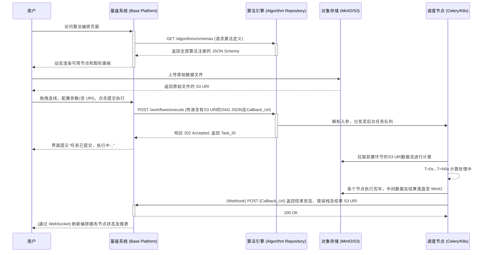

# 平台控制面与执行面分离架构设计 (Control Plane & Data Plane Separation)

## 1. 架构总览
在大中型数据或算法平台架构设计中，推荐采用**“控制平面 (Control Plane) 与数据/执行平面 (Execution Plane) 分离”**的微服务化设计思路。
- **平台基座（Base Platform）** 充当控制平面，负责系统层面的资源分配、状态机控制与用户交互。
- **算法库系统（Algorithm Repository/Engine）** 充当执行平面，专注承担耗时的算力负担，保证算法资产的一致性和独立性。

## 2. 职责边界划分

| 模块 | H平台基座（控制平面 / Control Plane） | 算法库系统（执行平面 / Execution Plane） |
| :--- | :--- | :--- |
| **定位** | 面向用户的门户、业务流转控制、可视化交互（UI编排） | 面向系统内部的计算引擎、算法资产管理、分布式任务调度 |
| **用户与权限**| 负责处理用户注册登录、部门权限(RBAC)、多租户隔离 | **无真实用户概念**，只认基座分配的租户ID、任务ID或API Key凭证 |
| **业务逻辑** | 算法节点拖拽、生成编排工作流定义(DAG JSON)、多级状态审批 | **无业务逻辑**，纯粹作为计算服务“接受DAG定义，严格执行内部调度” |
| **算法资产** | 仅存储算法的展示/元数据（名称、分类、图标、多语言描述） | 存储底层的**完整算法代码**、版本控制、以及输入输出 Schema 规范约束 |
| **调度与执行**| 扮演 API 消费者角色，组装触发指令并监控进度，不参与实质计算 | 依据拓扑排序解析 DAG，调度 Worker（如 Celery/K8s Job）进行异步运算 |

## 3. 核心交互机制设计

两者的交互原则是：**“同步获取元数据、异步调度任务引擎”**。

### A. 算法元数据动态加载（展示期）
基座前台的图编排页面显示的算法库内容，须由算法库系统动态提供。
1. 算法库统一定义 `GET /api/v1/algorithms/schemas` 接口。
2. 算法库输出注册在库中的所有算法及其参数描述（基于 JSON Schema 技术及 OpenAPI 规范）。
3. 基座根据 Schema 动态生成侧边栏模块及参数配置表单（校验规则由算法库约束并提供，基座前端直接解析）。

### B. 任务调度与提交机制（调度期）
计算图拉拽关联完成后触发计算：
1. **基座：** 将前端界面图关系转化为标准的有向无环图结构，形成包含 `nodes`（算法及参数）和 `edges`（数据依赖）的 JSON 载荷 Payload。
2. **基座：** 发送提交请求 `POST /api/v1/workflows/execute`。
3. **算法库：** 接收请求后仅作参数级别的 Pydantic Schema Validating校验，通过后**立即同步返回** `task_id` 和 202 状态码，切忌 HTTP 阻塞等待任务完成。

### C. 进度监控与结果回写（执行期）
计算属于长耗时任务，不可依赖 HTTP 轮询占用大量连接池，推荐事件驱动通信：
*   **Webhook回调方式**：基座在提交 Payload 内嵌 `callback_url`。算法库的 Worker 在任务状态机翻转（`Pending -> Running -> Success/Failed`）时主动推送进度，基座随后由 WebSocket 通知前端更新大图节点绿色/红色。
*   **消息流模式/MQ中间件**：同机房/私有化网络下，由算法库向 Kafka/RabbitMQ 或 Redis Stream 派发执行结果事件，基座系统作为消费者侦听并更新库表状态。

## 4. 数据隔离与共享存储方案

针对核心的大文件读写交互，确保两个平面的分离及解耦：

### 数据库层面（RDBMS） —— 物理隔离
- **基座DB（如 Postgres）**：存储 User 表、Project 表、画布草稿 (`dag_draft`) 等常规业务数据。
- **算法DB**：纯粹作为计算框架的 Backend，只存任务追踪日志 (`task_log`) 和注册表，双方严格禁止 SQL 层面跨库 Join 查物理表。

### 对象存储层面（OSS/MinIO） —— 文件共享解耦
- 源数据由用户在 **基座前端** 通过浏览器直传至 MinIO 存储桶中（如 `s3://tenant-bucket/raw_data.csv`）。
- 基座将该对象的 `s3_uri` 记录到节点入参后传给 **算法库**。
- 算法引擎下载 MinIO 数据到本地 Worker 计算，过程产生的中间结果及最终产物继续落地至 MinIO 临时或目标目录。
- 算法库通过 Webhook 回调时，仅返回最终结果数据的 `s3_uri`。基座随后下发预签名下载链接给前端用户。

## 5. 交互时序图 (Sequence Flow)

